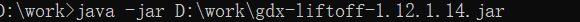

第一步，进入libgdx的官网。点击get started


进入这个页面，点击setup a project


进入这个页面直接点击，Generate a project.

.png)

点击下载，下载创建工具


它会让你下载一个jar包，有java环境的人可以双击直接打开。


把android和ios还有html不勾选。


看好了输出的位置。我这里的是D:\work\test  ，每个人的可能不同。

然后点击Generate进行生成项目。


生成后，用idea打开就行了。

打开时候的样子。


点击运行。结果图：


这样子就是成功了！！！


**新一代libgdx的官方jar包改成gdx-liftoff了**

# 新一代教程


下载到本地后，执行下面代码(将xxx.java改成相应的名字)：

```java
java -jar xxxx.jar
```



改一下项目名字，主类，包名


即可点击项目选项


默认是java的，当然，咱们也可以选语言，和扩展


点击下一步


这个选择想要的工具包，不想选就直接点击next即可


记住，这个一定要选17版本的java，目录也要选，下面是生成的项目文件


点击运行即可


项目在tutorialT01里面

