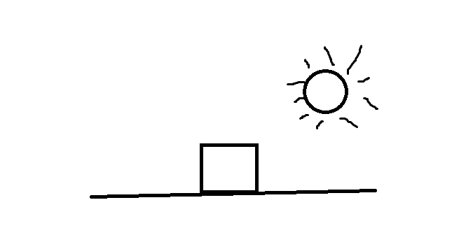
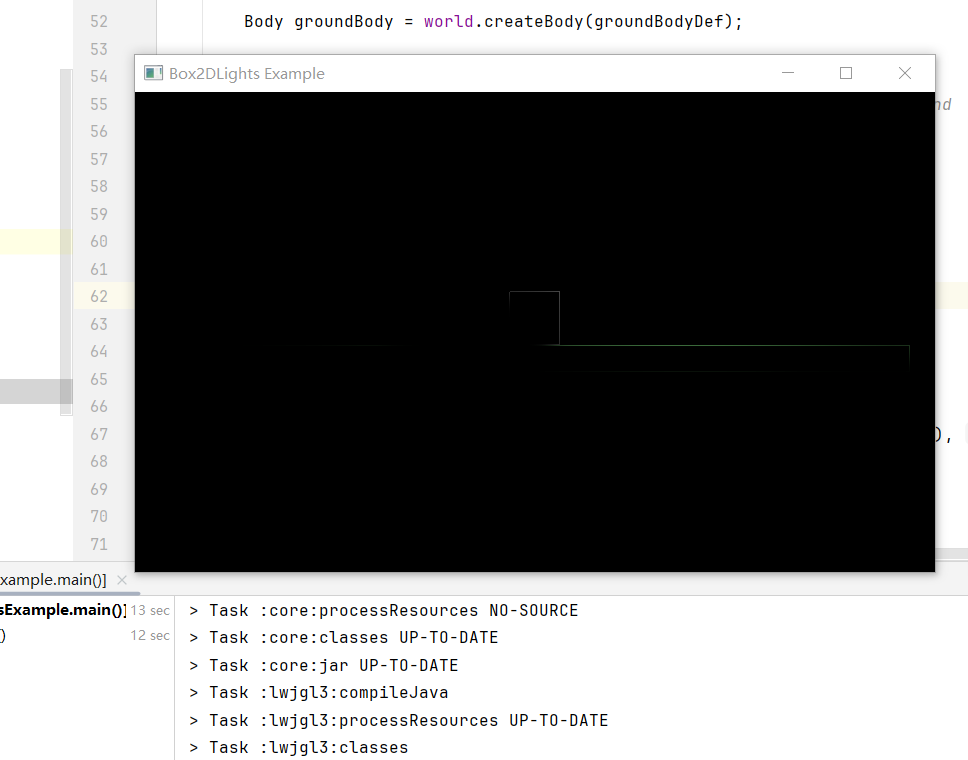

**介绍**：

`box2dLights` 是一个用于在 2D 游戏中实现动态光照效果的 Java 库，它与 Box2D 物理引擎结合使用，以便在游戏中创建复杂的光照和阴影效果

完整项目在本项目目录下的Chapter13文件夹

# 第一步：引入依赖

注意要先引入box2d

```
<dependency>
  <groupId>com.badlogicgames.box2dlights</groupId>
  <artifactId>box2dlights</artifactId>
  <version>1.4</version>
</dependency>
```

或者

```
api "com.badlogicgames.box2dlights:box2dlights:1.4"
```

或者咱们可以直接用官方的构造jar包，直接勾选box2dlights


# 第二步：演示案例（这里演示的是官方的SimpleTest）

完整代码：

```
package com.nanshaws;

import box2dLight.PointLight;
import box2dLight.RayHandler;

import com.badlogic.gdx.ApplicationAdapter;
import com.badlogic.gdx.Gdx;
import com.badlogic.gdx.graphics.GL20;
import com.badlogic.gdx.graphics.OrthographicCamera;
import com.badlogic.gdx.math.Vector2;
import com.badlogic.gdx.physics.box2d.World;

public class SimpleTest extends ApplicationAdapter {
	/** the camera **/
	OrthographicCamera camera;
	RayHandler rayHandler;
	World world;

	@Override
	public void create() {
		camera = new OrthographicCamera(48, 32);
		camera.update();
		world = new World(new Vector2(0, -10), true);
		rayHandler = new RayHandler(world);
		new PointLight(rayHandler, 32);

	}

	@Override
	public void render() {
		Gdx.gl.glClear(GL20.GL_COLOR_BUFFER_BIT);
		world.step(Gdx.graphics.getDeltaTime(), 8, 3);
		rayHandler.setCombinedMatrix(camera);
		rayHandler.updateAndRender();
	}
}
```

`box2dLights` 关键组件

1. **RayHandler**:
   \- `RayHandler` 是 `box2dLights` 的核心组件，负责管理和渲染所有光照效果。
   \- 它与 Box2D 的 `World` 对象结合使用，以计算光线与物体的交互、阴影投射等。

2. **PointLight**:
   \- `PointLight` 是一种光源类型，模拟了从一个点向四周发射光线的效果。
   \- 通过指定光线数量（例如：32），控制光源的渲染质量。更多的光线会使阴影边缘更平滑，但同时增加计算复杂度。

 代码解析

在 `SimpleTest` 类中，`box2dLights` 承担以下主要工作：

\- **光源初始化**：
\- 在 `create()` 方法中，创建了一个新的 `PointLight`，它被添加到了 `RayHandler` 中。不需要额外处理光的强度和位置，点光源会从默认位置(0,0)开始发散。

\- **光线渲染**：
\- 在 `render()` 方法中：
\- 清除屏幕以准备渲染新帧。
\- 更新物理世界的状态，以确保任何物理对象的更新（如移动或碰撞）能正确反映。
\- 使用 `rayHandler.setCombinedMatrix(camera)` 将光源矩阵与摄像机矩阵结合，这样光照效果会基于当前摄像机视图。
\- 调用 `rayHandler.updateAndRender()` 来计算所有的光线交互，并将结果渲染到屏幕上。

运行结果：


# 具体api解析（以下皆是用点光灯演示）

## 设置光线颜色

如果我们想要光线白色的话，可以设置颜色

```
  pointLight.setColor(1f, 1f, 1f, 1f); // 使用RGBA值，白色光且全不透明
```


## 设置光源的照射距离

如果我们想要设置光源的照射距离，可以使用以下代码

```
pointLight.setDistance(100f);
```


## 设置环境光

将环境光变亮一点可以使用这个

```
rayHandler.setAmbientLight(0.5f, 0.5f, 0.5f, 1f);
```


如果我们想把环境光改成绿色，并设置透明度为0.5可以使用以下代码

```
rayHandler.setAmbientLight(0f, 1f, 0f, 0.5f);
```


# pointLight具体api解析（上文就演示了设置点光源颜色和点光源距离）

`PointLight` 是 `box2dLight` 库中的一个类，用于创建一个点光源。点光源在2D空间中的一个点向所有方向发光。`PointLight` 提供了许多方法来控制光源的属性和行为。以下是 `PointLight` 的一些核心 API 方法及其解析：

## 构造方法一般用以下方法构造

```
        world = new World(new Vector2(0, -10), true);
		rayHandler = new RayHandler(world);
        PointLight pointLight = new PointLight(rayHandler, 32);
```

`rayHandler`: 管理光源的 `RayHandler` 实例。
`rays`: 指定用于渲染光照效果的光线数（影响阴影质量）。就是上文的32光线数

## 主要方法

\- **`setColor(Color color)`**
\- 设置光源的颜色。可以传入 `Color` 对象，来单独改变光的颜色。

\- **`setColor(float r, float g, float b, float a)`**
\- 设置光源的颜色和透明度。可以分别设置红、绿、蓝色值及不透明度（alpha）。

\- **`setDistance(float dist)`**
\- 设置光源的影响距离。此值决定了光源照射的有效半径。

\- **`setPosition(float x, float y)`**
\- 设置光源的位置。

\- **`setPosition(Vector2 position)`**
\- 设置光源的位置，使用 `Vector2` 对象。

\- **`attachToBody(Body body)`**
\- 将光源附加到 Box2D 的 `Body` 上，使光源跟随物体移动。

\- **`attachToBody(Body body, float offsetX, float offsetY)`**
\- 将光源附加到 Box2D 的 `Body` 上，并指定偏移量。

\- **`remove()`**
\- 从 `RayHandler` 中移除光源，并释放资源。

\- **`getX()` / `getY()`**
\- 返回光源的当前 X 或 Y 坐标。

\- **`setSoftnessLength(float softLength)`**
\- 设置光线之间的模糊长度。模糊可以创建更平滑的光效。

\- **`setStaticLight(boolean staticLight)`**
\- 设置光源是否为静态光源。静态光源通常优化处理，因为它们不会改变。

\- **`setActive(boolean active)`**
\- 启用或禁用光源。

# 光与影

项目代码演示图：




项目完整代码：

```
package com.nanshaws.lwjgl3;

import com.badlogic.gdx.ApplicationAdapter;
import com.badlogic.gdx.Gdx;
import com.badlogic.gdx.backends.lwjgl3.Lwjgl3Application;
import com.badlogic.gdx.backends.lwjgl3.Lwjgl3ApplicationConfiguration;
import com.badlogic.gdx.graphics.Color;
import com.badlogic.gdx.graphics.GL20;
import com.badlogic.gdx.graphics.OrthographicCamera;
import com.badlogic.gdx.physics.box2d.Body;
import com.badlogic.gdx.physics.box2d.BodyDef;
import com.badlogic.gdx.physics.box2d.Box2DDebugRenderer;
import com.badlogic.gdx.physics.box2d.Box2D;
import com.badlogic.gdx.physics.box2d.PolygonShape;
import com.badlogic.gdx.physics.box2d.World;
import com.badlogic.gdx.physics.box2d.BodyDef.BodyType;
import box2dLight.RayHandler;
import box2dLight.PointLight;

public class Box2DLightsExample extends ApplicationAdapter {
    private World world;
    private Box2DDebugRenderer debugRenderer;
    private OrthographicCamera camera;
    private RayHandler rayHandler;
    private Body body;

    @Override
    public void create() {
        Box2D.init();
        world = new World(new com.badlogic.gdx.math.Vector2(0, -9.8f), true);
        debugRenderer = new Box2DDebugRenderer();

        camera = new OrthographicCamera(32, 18); // This assumes 32x18 units camera. Adjust for your needs.

        // Create a box object in the world
        BodyDef bodyDef = new BodyDef();
        bodyDef.type = BodyType.DynamicBody;
        bodyDef.position.set(0, 5);

        body = world.createBody(bodyDef);

        PolygonShape box = new PolygonShape();
        box.setAsBox(1, 1);
        body.createFixture(box, 1);
        box.dispose();

        // Create the ground
        BodyDef groundBodyDef = new BodyDef();
        groundBodyDef.type = BodyType.StaticBody;
        groundBodyDef.position.set(0, -1); // Set this to place the ground correctly

        Body groundBody = world.createBody(groundBodyDef);

        PolygonShape groundBox = new PolygonShape();
        groundBox.setAsBox(15, 0.5f); // Width and height of the ground

        groundBody.createFixture(groundBox, 0);
        groundBox.dispose();

        // Set up the ray handler
        rayHandler = new RayHandler(world);
        rayHandler.setAmbientLight(0.2f); // Ambient light in the scene
        rayHandler.setCulling(true);
        RayHandler.useDiffuseLight(true);

        // Create a point light
        new PointLight(rayHandler, 128, new Color(1, 1, 1, 1), 20, 5, 5);
    }


    @Override
    public void render() {
        Gdx.gl.glClearColor(0, 0, 0, 1);
        Gdx.gl.glClear(GL20.GL_COLOR_BUFFER_BIT | GL20.GL_DEPTH_BUFFER_BIT);

        world.step(1 / 60f, 6, 2);

        camera.update();
        debugRenderer.render(world, camera.combined);

        rayHandler.setCombinedMatrix(camera);
        rayHandler.updateAndRender();
    }

    @Override
    public void dispose() {
        world.dispose();
        debugRenderer.dispose();
        rayHandler.dispose();
    }

    public static void main(String[] args) {
        Lwjgl3ApplicationConfiguration config = new Lwjgl3ApplicationConfiguration();

        config.setTitle("Box2DLights Example");
        config.setWindowedMode(800,480);  // 宽度，像素

        // 启动应用程序
        new Lwjgl3Application(new Box2DLightsExample(), config);
    }
}
```

项目运行结果：



可以看到光和影

