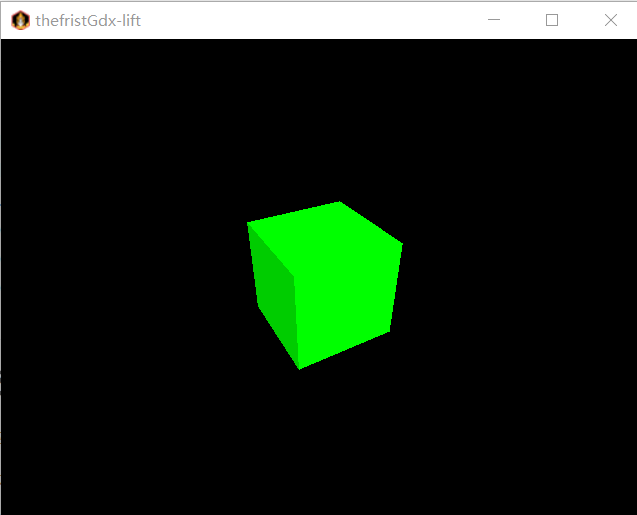

### 1. 设置开发环境

1. 安装 JDK：确保安装了 Java Development Kit (JDK)，建议使用最新稳定版本。

2. 安装 IDE：推荐使用 IntelliJ IDEA 或 Eclipse 作为开发环境。

3. 下载 LibGDX 项目设置工具：
- 前往 LibGDX 的官方网站下载项目生成工具。

4. 创建项目：
- 使用下载的设置工具创建一个新的 LibGDX 项目。在创建过程中可以选择添加 3D 支持。

### 2. 理解基本概念

1. 3D 坐标系：了解基本的 3D 坐标系（X, Y, Z）及其在 LibGDX 中的应用。

2. 摄像机（Camera）：
- 学习如何使用 PerspectiveCamera 来设置视角和投影。

3. 模型（Model）和模型实例（ModelInstance）：
- 理解如何加载和使用 3D 模型。
- 理解 Model 和 ModelInstance 的区别。

### 3. 创建基本 3D 场景

1. 设置 3D 摄像机：

   ```
   PerspectiveCamera camera = new PerspectiveCamera(67, Gdx.graphics.getWidth(), Gdx.graphics.getHeight());
   camera.position.set(10f, 10f, 10f);
   camera.lookAt(0, 0, 0);
   camera.near = 1f;
   camera.far = 300f;
   camera.update();
   ```
   
   


2. 加载和显示 3D 模型：

   ```
   ModelBatch modelBatch = new ModelBatch();
   Model model = new ModelBuilder().createBox(5f, 5f, 5f, 
       new Material(ColorAttribute.createDiffuse(Color.GREEN)), 
       VertexAttributes.Usage.Position | VertexAttributes.Usage.Normal);
   ModelInstance modelInstance = new ModelInstance(model);
   ```
   
   


3. 添加环境光照：

   ```
   Environment environment = new Environment();
   environment.add(new DirectionalLight().set(Color.WHITE, 1f, 0.8f, 0.2f));
   ```
   
   


4. 渲染循环：

       @Override
       public void render() {
           Gdx.gl.glViewport(0, 0, Gdx.graphics.getWidth(), Gdx.graphics.getHeight());
           Gdx.gl.glClear(GL20.GL_COLOR_BUFFER_BIT | GL20.GL_DEPTH_BUFFER_BIT);
           camera.update();
           modelBatch.begin(camera);
           modelBatch.render(modelInstance, environment);
           modelBatch.end();
       }


### 4. 添加交互

1. 处理用户输入：使用 Gdx.input 来处理键盘和鼠标输入，从而改变摄像机的视角或模型的位置。

2. 调整摄像机视角：
   - 可以通过鼠标拖拽、滚轮缩放等方式来调整摄像机的视角。

### 本教程的Libgdx3d代码如下：

```
package com.nanshaws.butt;

import com.badlogic.gdx.ApplicationAdapter;
import com.badlogic.gdx.Gdx;
import com.badlogic.gdx.graphics.Color;
import com.badlogic.gdx.graphics.GL20;
import com.badlogic.gdx.graphics.PerspectiveCamera;
import com.badlogic.gdx.graphics.VertexAttributes;
import com.badlogic.gdx.graphics.g3d.*;
import com.badlogic.gdx.graphics.g3d.attributes.ColorAttribute;
import com.badlogic.gdx.graphics.g3d.environment.DirectionalLight;
import com.badlogic.gdx.graphics.g3d.utils.ModelBuilder;
import com.badlogic.gdx.math.Vector3;

public class Main extends ApplicationAdapter {
    private PerspectiveCamera camera;
    private ModelBatch modelBatch;
    private Model model;
    private ModelInstance modelInstance;
    private Environment environment;

    @Override
    public void create() {
        modelBatch = new ModelBatch();

        // Set up the camera
        camera = new PerspectiveCamera(67, Gdx.graphics.getWidth(), Gdx.graphics.getHeight());
        camera.position.set(10f, 10f, 10f);
        camera.lookAt(0, 0, 0);
        camera.near = 1f;
        camera.far = 300f;
        camera.update();

        // Set up environment with directional light
        environment = new Environment();
        environment.set(new ColorAttribute(ColorAttribute.AmbientLight, 0.8f, 0.8f, 0.8f, 1f));
        environment.add(new DirectionalLight().set(0.8f, 0.8f, 0.8f, -1f, -0.8f, -0.2f));

        // Create a cube model
        ModelBuilder modelBuilder = new ModelBuilder();
        model = modelBuilder.createBox(5f, 5f, 5f,
                new Material(ColorAttribute.createDiffuse(Color.GREEN)),
                VertexAttributes.Usage.Position | VertexAttributes.Usage.Normal);
        modelInstance = new ModelInstance(model);
    }

    @Override
    public void render() {
        // Clear the screen
        Gdx.gl.glViewport(0, 0, Gdx.graphics.getWidth(), Gdx.graphics.getHeight());
        Gdx.gl.glClear(GL20.GL_COLOR_BUFFER_BIT | GL20.GL_DEPTH_BUFFER_BIT);

        // Rotate the cube
        modelInstance.transform.rotate(Vector3.Y, 1f);

        // Render model using the environment’s light settings
        modelBatch.begin(camera);
        modelBatch.render(modelInstance, environment);
        modelBatch.end();
    }

    @Override
    public void dispose() {
        modelBatch.dispose();
        model.dispose();
    }
}

```


### 创建方法

    @Override
    public void create() {
        modelBatch = new ModelBatch();
    // Set up the camera
    camera = new PerspectiveCamera(67, Gdx.graphics.getWidth(), Gdx.graphics.getHeight());
    camera.position.set(10f, 10f, 10f);
    camera.lookAt(0, 0, 0);
    camera.near = 1f;
    camera.far = 300f;
    camera.update();

- create() 方法：初始化应用程序的关键组件，并设置初始状态。
- modelBatch：用于处理模型的渲染批次。
- 摄像机设置：
- 创建 PerspectiveCamera，使用 67 度的视角。
- 设置摄像机位置为 (10, 10, 10)。
- 让摄像机朝向 (0, 0, 0)。
- 定义近平面 (near) 和远平面 (far) 为 1 和 300。
- 调用 update() 更新摄像机的投影矩阵。

    ```
    // Set up environment with directional light
    environment = new Environment();
    environment.set(new ColorAttribute(ColorAttribute.AmbientLight, 0.8f, 0.8f, 0.8f, 1f));
    environment.add(new DirectionalLight().set(0.8f, 0.8f, 0.8f, -1f, -0.8f, -0.2f));
    ```

    

- 光照设置：
- 创建 Environment 对象，用于储存环境光设置。
- 使用 ColorAttribute 设置环境光颜色为浅灰色。
- 创建一个方向光源，设置其方向为 (-1, -0.8, -0.2)，光线颜色为浅灰色。

    ```
    // Create a cube model
    ModelBuilder modelBuilder = new ModelBuilder();
    model = modelBuilder.createBox(5f, 5f, 5f,
            new Material(ColorAttribute.createDiffuse(Color.GREEN)),
            VertexAttributes.Usage.Position | VertexAttributes.Usage.Normal);
    modelInstance = new ModelInstance(model);
    }
    ```

    

- 创建立方体模型：
- 使用 ModelBuilder 创建一个立方体模型。
- 立方体的边长为 5 个单位。
- 使用 Material 设置立方体材质为绿色。
- 使用 VertexAttributes 指定模型顶点包含位置和法线信息。
- 创建 ModelInstance，这对于处理一个模型的多个实例如移动和旋转是必要的。

### 渲染方法

    @Override
    public void render() {
        // Clear the screen
        Gdx.gl.glViewport(0, 0, Gdx.graphics.getWidth(), Gdx.graphics.getHeight());
        Gdx.gl.glClear(GL20.GL_COLOR_BUFFER_BIT | GL20.GL_DEPTH_BUFFER_BIT);
    // Rotate the cube
    modelInstance.transform.rotate(Vector3.Y, 1f);
    
    // Render model using the environment’s light settings
    modelBatch.begin(camera);
    modelBatch.render(modelInstance, environment);
    modelBatch.end();
    }
- render() 方法：每帧调用以更新和渲染场景。
- 清空屏幕：
- 设置视口，确保渲染区域覆盖整个窗口。
- 清空颜色和深度缓存，以准备渲染新帧。
- 旋转模型：
- 对模型实例施加围绕 Y 轴旋转 1 度的变换。
- 渲染模型：
- 通过 modelBatch 开始渲染。
- 调用 render 方法，应用光照环境来渲染 modelInstance。
- 在结束渲染批次时调用 end()。

### 资源释放

```
@Override
public void dispose() {
    modelBatch.dispose();
    model.dispose();
}
```

- dispose() 方法：清理所有分配的本地资源，防止内存泄漏。
- modelBatch.dispose()：释放渲染批次使用的资源。
- model.dispose()：释放加载的模型资源。


### 运行本教程的Libgdx3d效果

