# Ui教程

Skin Composer 是一个可视化的界面编辑器，用于为 libGDX 游戏创建 UI 组件。Scene Composer 是 Skin Composer 的一个功能，它允许你创建和管理多个场景。以下是使用 Skin Composer 的 Scene Composer 的基本步骤：

1. 首先，你需要安装 Skin Composer。你可以从官方网站（https://skin-composer.com/）下载并安装适用于你的操作系统的版本。
2. 启动 Skin Composer，然后点击 "Create Project" 按钮创建一个新的 libGDX 项目。
3. 在 "Project Settings" 对话框中，输入你的项目名称和包名，然后选择一个 libGDX 版本。点击 "Finish" 按钮创建项目。
4. 在 Skin Composer 的主界面上，点击左侧的 "Scene Composer" 图标。这将打开 Scene Composer。
5. 在 Scene Composer 中，你可以看到一个空白的画布。要添加 UI 组件，只需从左侧的 "Widgets" 面板中拖放组件到画布上。例如，你可以拖放一个 "Label" 组件来创建一个文本标签。
6. 选中画布上的组件后，你可以在右侧的 "Properties" 面板中修改组件的属性，如文本、颜色、字体等。
7. 若要添加更多场景，请点击左上角的 "Add Scene" 按钮。这将在下方的场景列表中创建一个新的空白场景。你可以为每个场景添加不同的 UI 组件。
8. 若要在场景之间切换，只需在场景列表中选择相应的场景即可。你可以通过点击场景名称旁边的复选框来启用或禁用场景。
9. 当你完成 UI 设计后，点击顶部菜单栏的 "File" > "Export Skin" 将 UI 皮肤导出为 JSON 文件。这个文件可以用于你的 libGDX 项目。

打开Skin Composer软件

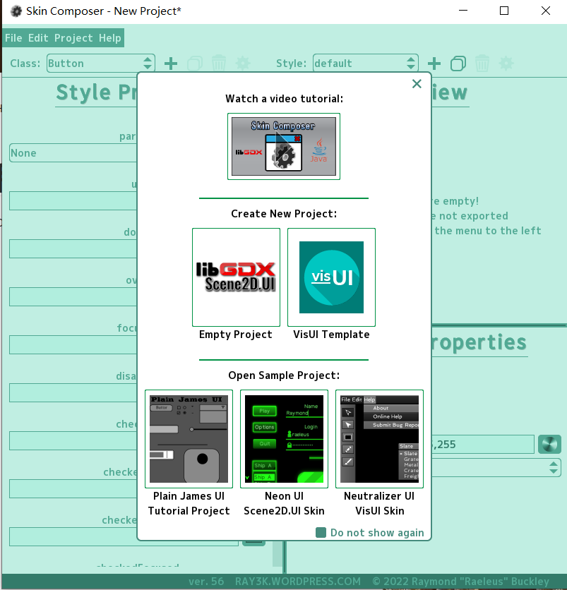

点击Project --->  Scene Composer

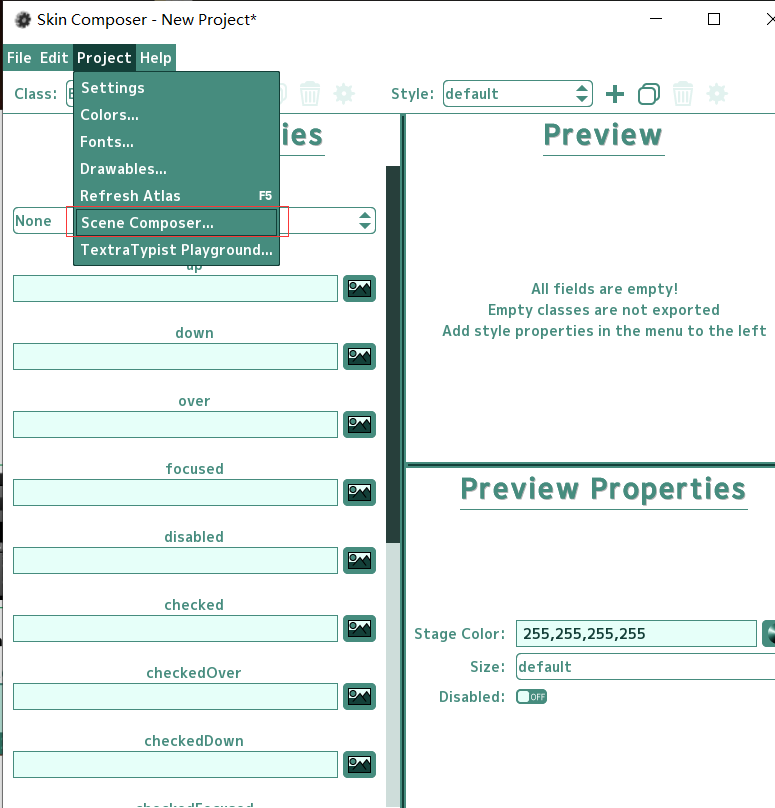


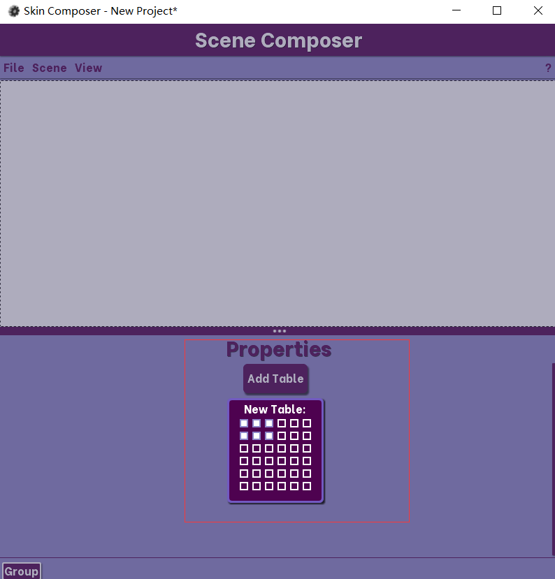

set  Widget是设置小部件的意思


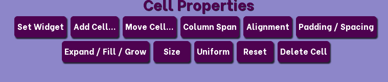

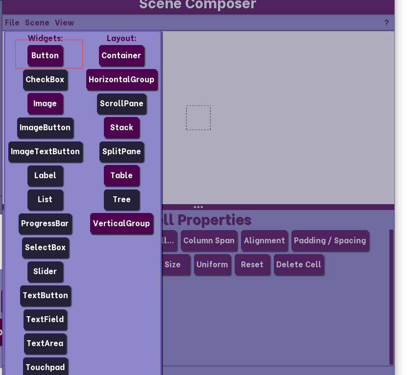

设置一下按钮样式

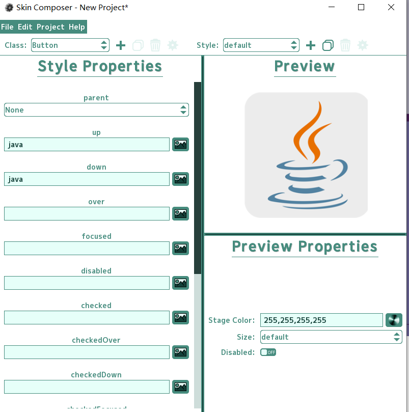

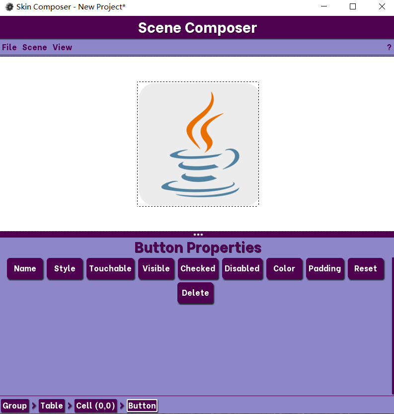

# 注意

我们有两种方式创建ui，第一种方式是直接在table上面写，设置table的背景，然后在table上面搞两个按钮，类似于：

下面是因为我的按钮大小太大了，所以搞至不美观

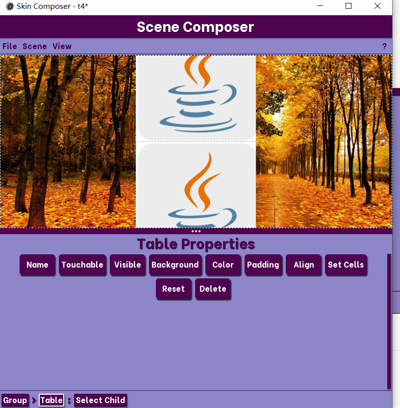

另外一种方式是在cell后面搞一个Stack,然后设置image和table，然后再在table里面设置按钮


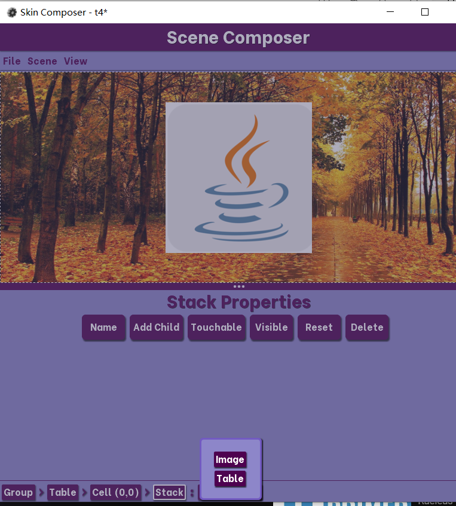

如果有像样的素材可以做出蛮不错的页面：

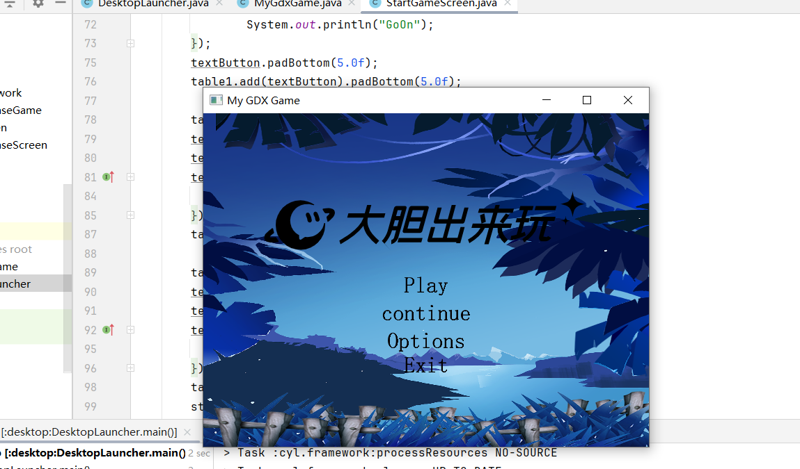

# 最后导出

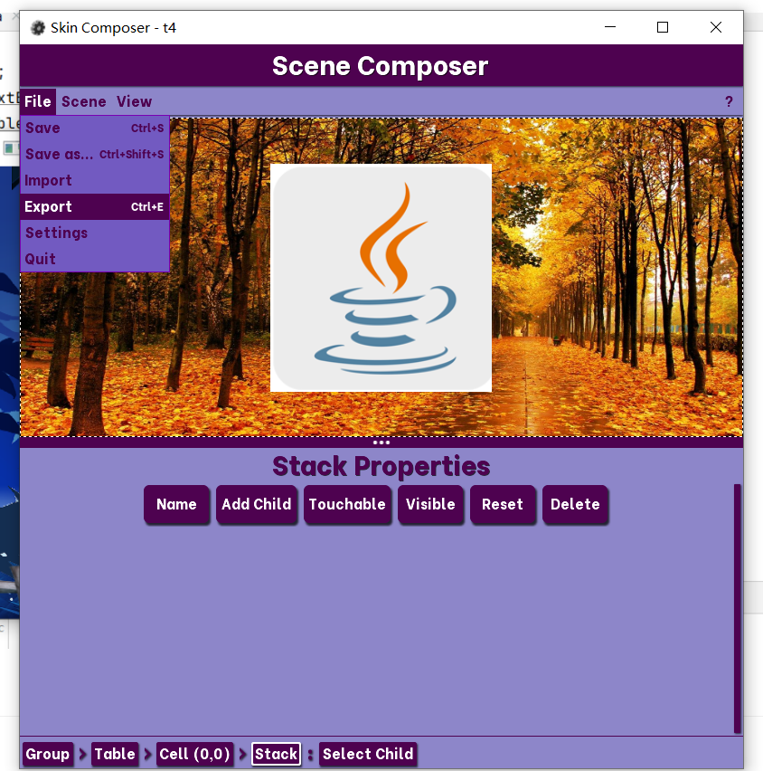

导出json文件


然后copy一下java代码即可

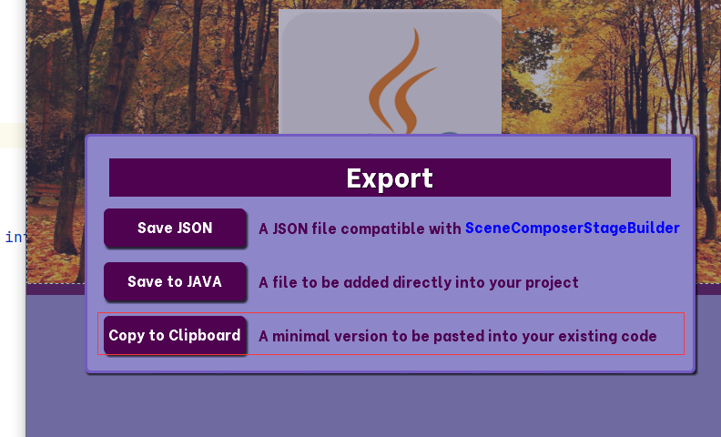

```
stage = new Stage(new ScreenViewport());
skin = new Skin(Gdx.files.internal("t1.json"));
Gdx.input.setInputProcessor(stage);

Table table = new Table();
table.setFillParent(true);

Stack stack = new Stack();

Image image = new Image(skin, "t1");
stack.addActor(image);

Table table1 = new Table();

Button button = new Button(skin);
table1.add(button);
stack.addActor(table1);
table.add(stack);
stage.addActor(table);
```

