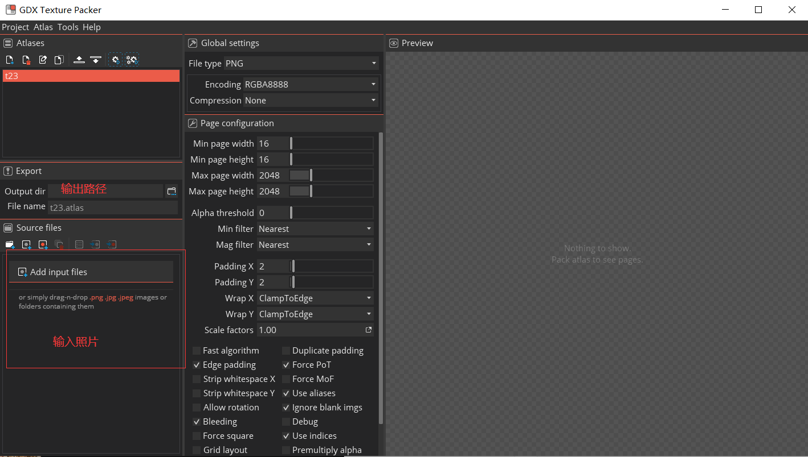
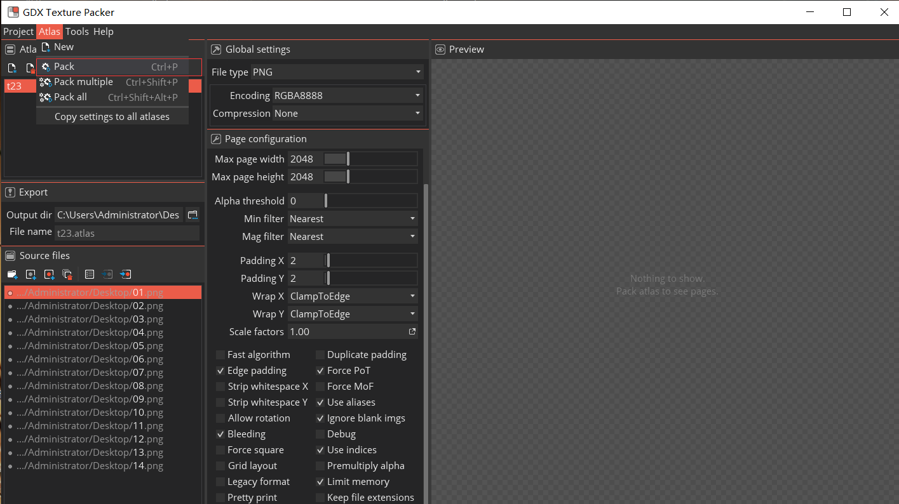
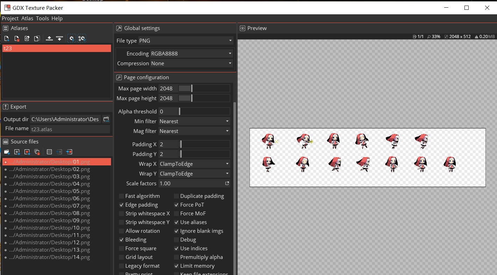
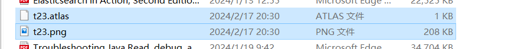
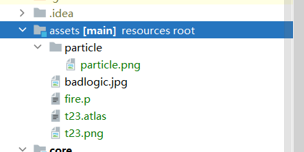
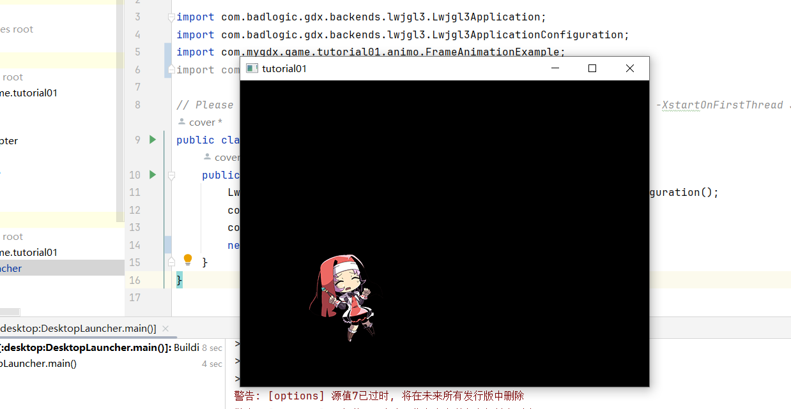
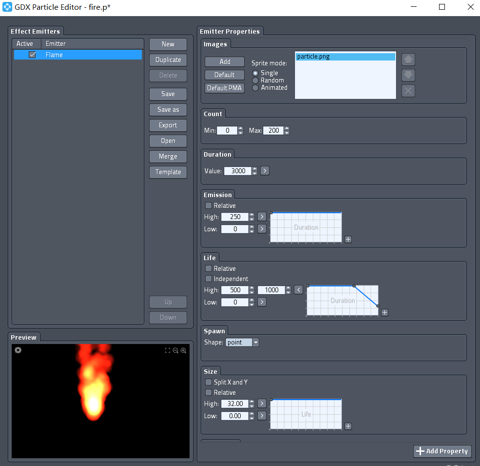
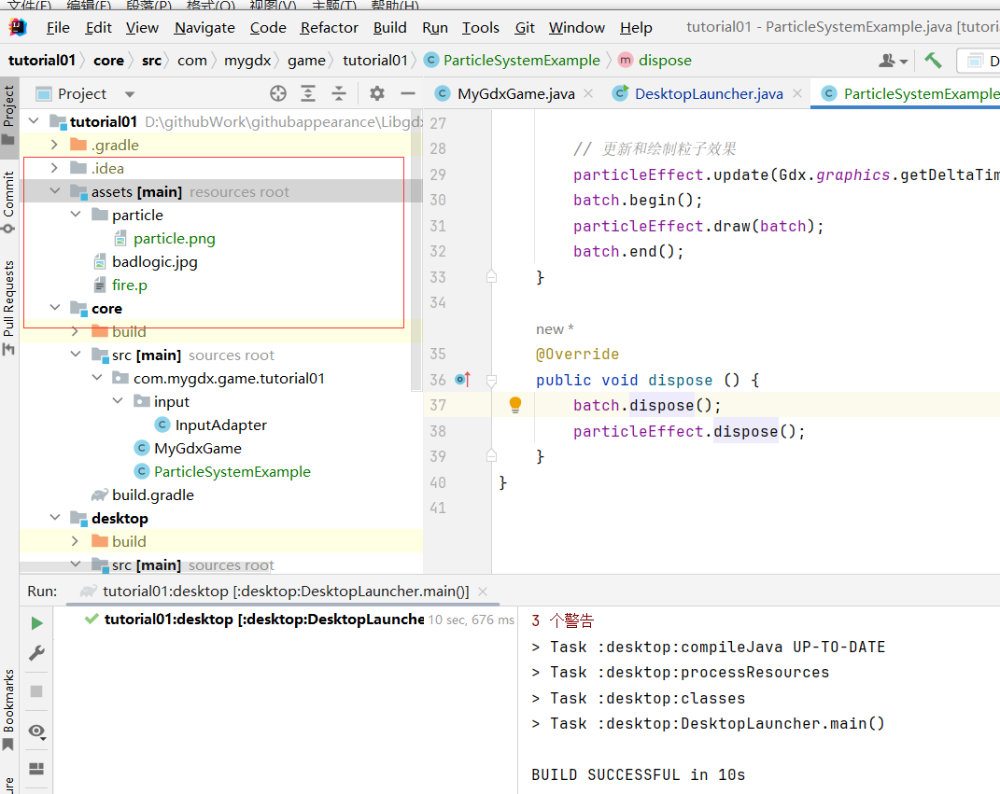
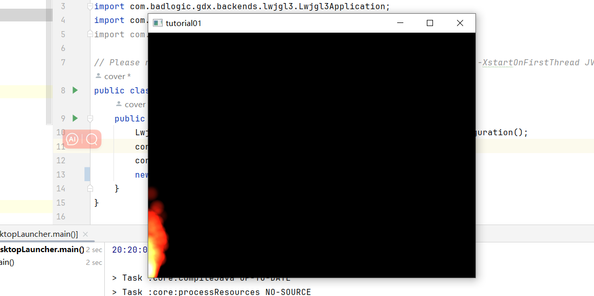

## 4.1 帧动画

利用GDX Texture Packer创建实现帧动画



如同下面做法：


然后打包：





将t23.atlas和t23.png保存到项目中





在libGDX中，可以使用TextureAtlas和Animation类来实现帧动画。以下是一个简单的示例：

```
import com.badlogic.gdx.ApplicationAdapter;
import com.badlogic.gdx.Gdx;
import com.badlogic.gdx.graphics.GL20;
import com.badlogic.gdx.graphics.g2d.Animation;
import com.badlogic.gdx.graphics.g2d.SpriteBatch;
import com.badlogic.gdx.graphics.g2d.TextureAtlas;
import com.badlogic.gdx.utils.Array;

public class FrameAnimationExample extends ApplicationAdapter {
    private SpriteBatch batch;
    private TextureAtlas textureAtlas;
    private Animation<TextureAtlas.AtlasRegion> animation;
    private float elapsedTime;

    @Override
    public void create() {
        batch = new SpriteBatch();
        textureAtlas = new TextureAtlas(Gdx.files.internal("animation_frames.atlas"));
        Array<TextureAtlas.AtlasRegion> frames = textureAtlas.getRegions();
        animation = new Animation<>(0.02f, frames);
        elapsedTime = 0;
    }

    @Override
    public void render() {
        Gdx.gl.glClearColor(0, 0, 0, 1);
        Gdx.gl.glClear(GL20.GL_COLOR_BUFFER_BIT);
        elapsedTime += Gdx.graphics.getDeltaTime();
        batch.begin();
        batch.draw(animation.getKeyFrame(elapsedTime, true), 50, 50);
        batch.end();
    }

    @Override
    public void dispose() {
        batch.dispose();
        textureAtlas.dispose();
    }
}
 
```

结果展示：



## 4.2 骨骼动画

在libGDX中，可以使用SkeletonRenderer和SkeletonJson类来实现骨骼动画。以下是一个简单的示例：

```
import com.badlogic.gdx.ApplicationAdapter;
import com.badlogic.gdx.Gdx;
import com.badlogic.gdx.graphics.GL20;
import com.badlogic.gdx.graphics.g2d.SpriteBatch;
import com.badlogic.gdx.graphics.g2d.TextureAtlas;
import com.badlogic.gdx.graphics.g2d.TextureRegion;
import com.badlogic.gdx.scenes.scene2d.ui.Skin;
import com.badlogic.gdx.scenes.scene2d.ui.TextButton;
import com.badlogic.gdx.scenes.scene2d.utils.NinePatchDrawable;
import com.esotericsoftware.spine.*;
import com.esotericsoftware.spine.attachments.AtlasAttachmentLoader;
import com.esotericsoftware.spine.attachments.SkeletonAttachment;

public class SkeletonAnimationExample extends ApplicationAdapter {
    private SkeletonRenderer skeletonRenderer;
    private SkeletonJson json;
    private SkeletonData skeletonData;
    private Skeleton skeleton;
    private float elapsedTime;

    @Override
    public void create() {
        json = new SkeletonJson();
        skeletonData = json.readSkeletonData(Gdx.files.internal("skeleton_animation.json"));
        skeleton = new Skeleton(skeletonData);
        skeletonRenderer = new SkeletonRenderer();
        skeletonRenderer.setPremultipliedAlpha(false);
        elapsedTime = 0;
    }

    @Override
    public void render() {
        Gdx.gl.glClearColor(0, 0, 0, 1);
        Gdx.gl.glClear(GL20.GL_COLOR_BUFFER_BIT);
        elapsedTime += Gdx.graphics.getDeltaTime();
        skeleton.updateWorldTransform();
        skeletonRenderer.draw(skeleton);
    }

    @Override
    public void dispose() {
        skeletonData.dispose();
    }
}

```

## 4.3 粒子系统

利用GDX particle Editor 创建粒子，保存生成.p文件和.png



在libGDX中，可以使用ParticleEffect类来实现粒子系统。以下是一个简单的示例：

```
package com.mygdx.game.tutorial01;

import com.badlogic.gdx.ApplicationAdapter;
import com.badlogic.gdx.Gdx;
import com.badlogic.gdx.graphics.GL20;
import com.badlogic.gdx.graphics.g2d.ParticleEffect;
import com.badlogic.gdx.graphics.g2d.SpriteBatch;

public class ParticleSystemExample extends ApplicationAdapter {
    private SpriteBatch batch;
    private ParticleEffect particleEffect;

    @Override
    public void create () {
        batch = new SpriteBatch();

        // 创建粒子效果
        particleEffect = new ParticleEffect();
        particleEffect.load(Gdx.files.internal("fire.p"), Gdx.files.internal("particle"));
        particleEffect.start();
    }

    @Override
    public void render () {
        Gdx.gl.glClearColor(0, 0, 0, 1);
        Gdx.gl.glClear(GL20.GL_COLOR_BUFFER_BIT);

        // 更新和绘制粒子效果
        particleEffect.update(Gdx.graphics.getDeltaTime());
        batch.begin();
        particleEffect.draw(batch);
        batch.end();
    }

    @Override
    public void dispose () {
        batch.dispose();
        particleEffect.dispose();
    }
}

```

目录格式：



展示结果：



正常出现在左下角。
