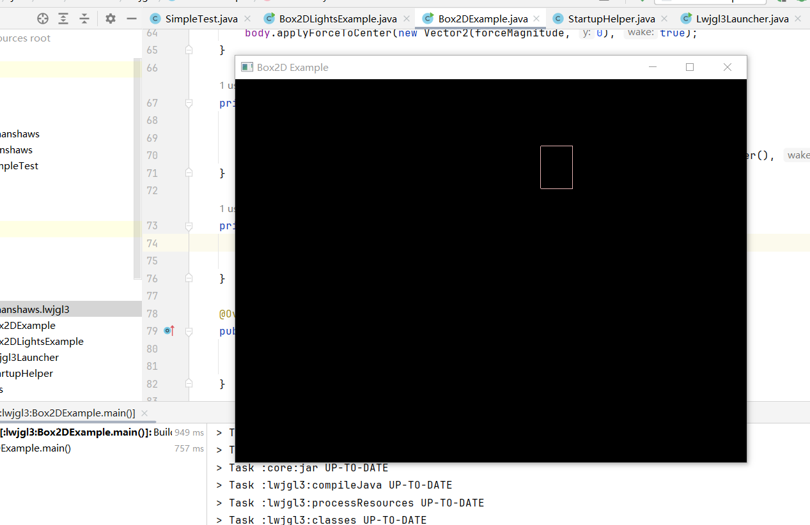

## 6.1 Box2D简介

Box2D是一个开源的二维物理引擎，用于模拟刚体物体在二维空间中的运动。它被广泛应用于游戏开发中，以实现真实的物理效果。Box2D提供了碰撞检测、刚体动力学和关节等功能，帮助开发者轻松地创建具有物理行为的虚拟世界。

## 6.2 创建物理世界

在libGDX中，可以使用以下代码创建一个Box2D物理世界：

```
import com.badlogic.gdx.math.Vector2;
import com.badlogic.gdx.physics.box2d.*;

public class MyGame extends ApplicationAdapter {
    private static final float PPM = 100; // 像素每米
    private World world;

    @Override
    public void create() {
        // 设置重力
        Vector2 gravity = new Vector2(0, -9.8f);

        // 创建物理世界
        world = new World(gravity, true);
    }

    // ...
}

```

## 6.3 刚体与关节

刚体（Body）是Box2D中的基本物理实体，表示一个具有质量、形状和运动状态的物体。可以通过以下方式创建一个刚体：

```
// 创建一个矩形刚体
BodyDef bodyDef = new BodyDef();
bodyDef.type = BodyDef.BodyType.DynamicBody;
bodyDef.position.set(new Vector2(50 / PPM, 50 / PPM));

PolygonShape shape = new PolygonShape();
shape.setAsBox(1, 1);

FixtureDef fixtureDef = new FixtureDef();
fixtureDef.shape = shape;
fixtureDef.density = 1.0f;

Body body = world.createBody(bodyDef);
body.createFixture(fixtureDef);
shape.dispose();

```

关节（Joint）用于连接两个或多个刚体，限制它们的相对运动。例如，可以创建一个距离关节来连接两个刚体：

```
RevoluteJointDef jointDef = new RevoluteJointDef();
jointDef.bodyA = bodyA;
jointDef.bodyB = bodyB;
jointDef.localAnchorA.set(-0.5f, 0);
jointDef.localAnchorB.set(0.5f, 0);
jointDef.referenceAngle = (float) Math.PI * 0.5f;

world.createJoint(jointDef);

```

## 6.4 碰撞监听完整案例教程

要实现碰撞监听，需要创建一个自定义的ContactListener类，并重写其方法。以下是一个简单的碰撞监听示例：

```
public class MyContactListener implements ContactListener {
    @Override
    public void beginContact(Contact contact) {
        // 当两个物体开始接触时调用
    }

    @Override
    public void endContact(Contact contact) {
        // 当两个物体结束接触时调用
    }

    @Override
    public void preSolve(Contact contact, Manifold oldManifold) {
        // 在求解器计算之前调用
    }

    @Override
    public void postSolve(Contact contact, ContactImpulse impulse) {
        // 在求解器计算之后调用
    }
}

```

然后在游戏循环中添加碰撞监听：

```
world.setContactListener(new MyContactListener());
```

## 6.5 完整简单案例代码

```
package com.mygdx.game.tutorial01;

import com.badlogic.gdx.ApplicationAdapter;
import com.badlogic.gdx.Gdx;
import com.badlogic.gdx.graphics.GL20;
import com.badlogic.gdx.graphics.OrthographicCamera;
import com.badlogic.gdx.math.Vector2;
import com.badlogic.gdx.physics.box2d.*;

public class Box2DExample extends ApplicationAdapter {
    private OrthographicCamera camera;
    private Box2DDebugRenderer debugRenderer;
    private World world;
    private Body ground;
    private Body box;
    private float PPM=30;
    @Override
    public void create() {
        camera = new OrthographicCamera();
        camera.setToOrtho(false, Gdx.graphics.getWidth() / PPM, Gdx.graphics.getHeight() / PPM);
        debugRenderer = new Box2DDebugRenderer();

        world = new World(new Vector2(0, -9.8f), true);

        // 创建地面
        BodyDef groundDef = new BodyDef();
        groundDef.position.set(0, 0);
        ground = world.createBody(groundDef);
        PolygonShape groundShape = new PolygonShape();
        groundShape.setAsBox(50, 1);
        ground.createFixture(groundShape, 0);
        groundShape.dispose();

        // 创建箱子
        BodyDef boxDef = new BodyDef();
        boxDef.type = BodyDef.BodyType.DynamicBody;
        boxDef.position.set(0, 10);
        box = world.createBody(boxDef);
        PolygonShape boxShape = new PolygonShape();
        boxShape.setAsBox(1, 1);
        box.createFixture(boxShape, 1);
        boxShape.dispose();
    }

    @Override
    public void render() {
        Gdx.gl.glClearColor(0, 0, 0, 1);
        Gdx.gl.glClear(GL20.GL_COLOR_BUFFER_BIT);

        camera.update();
        debugRenderer.render(world, camera.combined);

        world.step(1 / 60f, 6, 2);
    }

    @Override
    public void dispose() {
        world.dispose();
        debugRenderer.dispose();
    }
}

```


## 6.6 加入键盘监听器完整案例代码

```
package com.mygdx.game.tutorial01;

import com.badlogic.gdx.ApplicationAdapter;
import com.badlogic.gdx.Gdx;
import com.badlogic.gdx.Input;
import com.badlogic.gdx.graphics.GL20;
import com.badlogic.gdx.graphics.OrthographicCamera;
import com.badlogic.gdx.math.Vector2;
import com.badlogic.gdx.physics.box2d.*;

public class Box2DExample extends ApplicationAdapter {
    private OrthographicCamera camera;
    private Box2DDebugRenderer debugRenderer;
    private World world;
    private Body ground;
    private Body box;
    private float PPM=30f;
    @Override
    public void create() {
        camera = new OrthographicCamera();
        camera.setToOrtho(false, Gdx.graphics.getWidth() / PPM, Gdx.graphics.getHeight() / PPM);
        debugRenderer = new Box2DDebugRenderer();

        world = new World(new Vector2(0, -9.8f), true);
        MyContactListener contactListener = new MyContactListener();
        world.setContactListener(contactListener);

        // 创建地面
        BodyDef groundDef = new BodyDef();
        groundDef.type= BodyDef.BodyType.StaticBody;
        groundDef.position.set(0, 0);
        ground = world.createBody(groundDef);
        PolygonShape groundShape = new PolygonShape();
        groundShape.setAsBox(50, 1);
        ground.createFixture(groundShape, 0);
        groundShape.dispose();

        // 创建箱子
        BodyDef boxDef = new BodyDef();
        boxDef.type = BodyDef.BodyType.DynamicBody;
        boxDef.position.set(0, 10);
        box = world.createBody(boxDef);
        PolygonShape boxShape = new PolygonShape();
        boxShape.setAsBox(1, 1);
        box.createFixture(boxShape, 1);
        boxShape.dispose();
    }

    @Override
    public void render() {
        Gdx.gl.glClearColor(0, 0, 0, 1);
        Gdx.gl.glClear(GL20.GL_COLOR_BUFFER_BIT);

        camera.update();
        debugRenderer.render(world, camera.combined);

        // 检查用户输入并更新箱子位置
        if (Gdx.input.isKeyPressed(Input.Keys.A)) {
            box.setLinearVelocity(-5,0);
        } else if (Gdx.input.isKeyPressed(Input.Keys.D)) {
            box.setLinearVelocity(5, 0);
        } else if (Gdx.input.isKeyPressed(Input.Keys.W)) {
            box.setLinearVelocity(0, 5);
        } else if (Gdx.input.isKeyPressed(Input.Keys.S)) {
            box.setLinearVelocity(0, -5);
        }
        world.step(1 / 60f, 6, 2);
    }

    @Override
    public void dispose() {
        world.dispose();
        debugRenderer.dispose();
    }
}

```

## 6.7 box2d物体移动的三种方式

### applyForce();    // 施加力

### applyImpulse();  // 施加冲量

### setVelocity();   // 设置速度

```java
package com.nanshaws.lwjgl3;

import com.badlogic.gdx.ApplicationAdapter;
import com.badlogic.gdx.Gdx;
import com.badlogic.gdx.backends.lwjgl3.Lwjgl3Application;
import com.badlogic.gdx.backends.lwjgl3.Lwjgl3ApplicationConfiguration;
import com.badlogic.gdx.graphics.GL20;
import com.badlogic.gdx.graphics.OrthographicCamera;
import com.badlogic.gdx.math.Vector2;
import com.badlogic.gdx.physics.box2d.Body;
import com.badlogic.gdx.physics.box2d.BodyDef;
import com.badlogic.gdx.physics.box2d.Box2DDebugRenderer;
import com.badlogic.gdx.physics.box2d.Box2D;
import com.badlogic.gdx.physics.box2d.PolygonShape;
import com.badlogic.gdx.physics.box2d.World;
import com.badlogic.gdx.physics.box2d.BodyDef.BodyType;

public class Box2DExample extends ApplicationAdapter {
    private World world;
    private Box2DDebugRenderer debugRenderer;
    private Body body;
    private OrthographicCamera camera;

    @Override
    public void create() {
        Box2D.init();
        world = new World(new Vector2(0, -9.8f), true);
        debugRenderer = new Box2DDebugRenderer();
        // 设置摄像机尺寸。假设是一个32单位宽的世界。
        camera = new OrthographicCamera(32, 18);
        camera.position.set(0, 0, 0);
        camera.update();
        // 创建一个动态物体
        BodyDef bodyDef = new BodyDef();
        bodyDef.type = BodyType.DynamicBody;
        bodyDef.position.set(0, 5);

        body = world.createBody(bodyDef);
        PolygonShape box = new PolygonShape();
        box.setAsBox(1, 1); // 创建一个1x1的方形
        body.createFixture(box, 1);
        box.dispose();
    }

    @Override
    public void render() {
        Gdx.gl.glClear(GL20.GL_COLOR_BUFFER_BIT);

        // 模拟世界
        world.step(1 / 60f, 6, 2);

        // 通过不同方式影响物体运动
        applyForce();    // 施加力
        applyImpulse();  // 施加冲量
        setVelocity();   // 设置速度

        // 渲染
        debugRenderer.render(world, camera.combined);
    }

    private void applyForce() {
        // 向右施加一个持续的力
        float forceMagnitude = 10.0f;
        body.applyForceToCenter(new Vector2(forceMagnitude, 0), true);
    }

    private void applyImpulse() {
        // 立即向上施加一个冲量
        float impulseMagnitude = 5.0f;
        body.applyLinearImpulse(new Vector2(0, impulseMagnitude), body.getWorldCenter(), true);
    }

    private void setVelocity() {
        // 直接将物体的速度设置为向右的5单位/秒
        body.setLinearVelocity(new Vector2(5, 0));
    }

    @Override
    public void dispose() {
        world.dispose();
        debugRenderer.dispose();
    }

    public static void main(String[] args) {
        Lwjgl3ApplicationConfiguration config = new Lwjgl3ApplicationConfiguration();
        config.setTitle("Box2D Example");
        config.setWindowedMode(800, 600);
        new Lwjgl3Application(new Box2DExample(), config);
    }
}
```



## box2d的api介绍

1. `World`（世界）
   \- **Description**: 世界是物理引擎的核心。它管理所有的物理对象和模拟。
   \- **Key Methods**:
   \- `step(float timeStep, int velocityIterations, int positionIterations)`: 执行物理仿真的步骤。
   \- `createBody(BodyDef bodyDef)`: 创建一个新的物理身体。
   \- `destroyBody(Body body)`: 销毁指定的物理身体。

2. `Body`（身体）
   \- **Description**: 物理世界中的实体。每个身体都有位置、速度、角速度等。
   \- **Types**: 静态（Static）、动态（Dynamic）、运动学（Kinematic）。
   \- **Key Methods**:
   \- `createFixture(FixtureDef fixtureDef)`: 给身体添加夹具（fixture）。
   \- `setTransform(Vector2 position, float angle)`: 设置身体的位置和旋转。
   \- `applyForce(Vector2 force, Vector2 point, boolean wake)`: 对身体施加一个力。

3. `Fixture`（夹具）
   \- **Description**: 附加到身体上的一个物理形状，它定义了碰撞几何和物理属性（密度、摩擦、弹性）。
   \- **Key Methods**:
   \- `getShape()`: 获取夹具的形状。
   \- `setSensor(boolean sensor)`: 设置是否为传感器夹具（传感器不会产生碰撞响应）。

4. `Shape`（形状）
   \- **Types**: `CircleShape`（圆形）、`PolygonShape`（多边形）、`EdgeShape`（边缘）、`ChainShape`（链条）。
   \- **Key Methods**:
   \- `setAsBox(float hx, float hy)`: 为多边形形状设置一个盒子形状。
   \- 各形状有特定的方法用来定义它们的几何属性。

5. `BodyDef`（身体定义）
   \- **Description**: 用于定义身体的属性。
   \- **Key Properties**:
   \- `type`: `BodyType`（静态、动态、运动学）
   \- `position`: 初始位置
   \- `angle`: 初始角度

6. `FixtureDef`（夹具定义）
   \- **Description**: 用于定义夹具的属性。
   \- **Key Properties**:
   \- `shape`: 形状对象
   \- `density`: 密度
   \- `friction`: 摩擦系数
   \- `restitution`: 恢复系数

7. `Joint`（关节）
   \- **Description**: 用于连接两个或多个身体，以限制它们之间的相对运动。
   \- **Types**: `DistanceJoint`（距离关节）、`RevoluteJoint`（旋转关节）、`PrismaticJoint`（棱柱关节）、`PulleyJoint`（滑轮关节）等。
   \- **Key Methods**:
   \- Joints usually have methods to set limits or motors depending on the type.

8. `ContactListener`（碰撞监听器）
   \- **Description**: 用于处理接触事件的接口。
   \- **Key Methods**:
   \- `beginContact(Contact contact)`: 当两个夹具开始接触时调用。
   \- `endContact(Contact contact)`: 当两个夹具结束接触时调用。
   \- `preSolve(Contact contact, Manifold oldManifold)`: 在接触求解之前调用。
   \- `postSolve(Contact contact, ContactImpulse impulse)`: 在接触求解之后调用。

9. `RayCastCallback`（光线投射回调）
   \- **Description**: 用于处理光线投射结果的接口。
   \- **Key Methods**:
   \- `reportFixture(Fixture fixture, Vector2 point, Vector2 normal, float fraction)`: 在光线与夹具接触时调用
