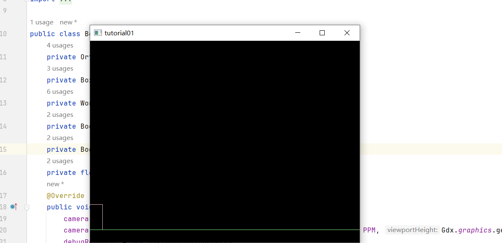

## 6.1 Box2D简介

Box2D是一个开源的二维物理引擎，用于模拟刚体物体在二维空间中的运动。它被广泛应用于游戏开发中，以实现真实的物理效果。Box2D提供了碰撞检测、刚体动力学和关节等功能，帮助开发者轻松地创建具有物理行为的虚拟世界。

## 6.2 创建物理世界

在libGDX中，可以使用以下代码创建一个Box2D物理世界：

```
import com.badlogic.gdx.math.Vector2;
import com.badlogic.gdx.physics.box2d.*;

public class MyGame extends ApplicationAdapter {
    private static final float PPM = 100; // 像素每米
    private World world;

    @Override
    public void create() {
        // 设置重力
        Vector2 gravity = new Vector2(0, -9.8f);

        // 创建物理世界
        world = new World(gravity, true);
    }

    // ...
}

```

## 6.3 刚体与关节

刚体（Body）是Box2D中的基本物理实体，表示一个具有质量、形状和运动状态的物体。可以通过以下方式创建一个刚体：

```
// 创建一个矩形刚体
BodyDef bodyDef = new BodyDef();
bodyDef.type = BodyDef.BodyType.DynamicBody;
bodyDef.position.set(new Vector2(50 / PPM, 50 / PPM));

PolygonShape shape = new PolygonShape();
shape.setAsBox(1, 1);

FixtureDef fixtureDef = new FixtureDef();
fixtureDef.shape = shape;
fixtureDef.density = 1.0f;

Body body = world.createBody(bodyDef);
body.createFixture(fixtureDef);
shape.dispose();

```

关节（Joint）用于连接两个或多个刚体，限制它们的相对运动。例如，可以创建一个距离关节来连接两个刚体：

```
RevoluteJointDef jointDef = new RevoluteJointDef();
jointDef.bodyA = bodyA;
jointDef.bodyB = bodyB;
jointDef.localAnchorA.set(-0.5f, 0);
jointDef.localAnchorB.set(0.5f, 0);
jointDef.referenceAngle = (float) Math.PI * 0.5f;

world.createJoint(jointDef);

```

## 6.4 碰撞监听完整案例教程

要实现碰撞监听，需要创建一个自定义的ContactListener类，并重写其方法。以下是一个简单的碰撞监听示例：

```
public class MyContactListener implements ContactListener {
    @Override
    public void beginContact(Contact contact) {
        // 当两个物体开始接触时调用
    }

    @Override
    public void endContact(Contact contact) {
        // 当两个物体结束接触时调用
    }

    @Override
    public void preSolve(Contact contact, Manifold oldManifold) {
        // 在求解器计算之前调用
    }

    @Override
    public void postSolve(Contact contact, ContactImpulse impulse) {
        // 在求解器计算之后调用
    }
}

```

然后在游戏循环中添加碰撞监听：

```
world.setContactListener(new MyContactListener());
```

## 6.5 完整简单案例代码

```
package com.mygdx.game.tutorial01;

import com.badlogic.gdx.ApplicationAdapter;
import com.badlogic.gdx.Gdx;
import com.badlogic.gdx.graphics.GL20;
import com.badlogic.gdx.graphics.OrthographicCamera;
import com.badlogic.gdx.math.Vector2;
import com.badlogic.gdx.physics.box2d.*;

public class Box2DExample extends ApplicationAdapter {
    private OrthographicCamera camera;
    private Box2DDebugRenderer debugRenderer;
    private World world;
    private Body ground;
    private Body box;
    private float PPM=30;
    @Override
    public void create() {
        camera = new OrthographicCamera();
        camera.setToOrtho(false, Gdx.graphics.getWidth() / PPM, Gdx.graphics.getHeight() / PPM);
        debugRenderer = new Box2DDebugRenderer();

        world = new World(new Vector2(0, -9.8f), true);

        // 创建地面
        BodyDef groundDef = new BodyDef();
        groundDef.position.set(0, 0);
        ground = world.createBody(groundDef);
        PolygonShape groundShape = new PolygonShape();
        groundShape.setAsBox(50, 1);
        ground.createFixture(groundShape, 0);
        groundShape.dispose();

        // 创建箱子
        BodyDef boxDef = new BodyDef();
        boxDef.type = BodyDef.BodyType.DynamicBody;
        boxDef.position.set(0, 10);
        box = world.createBody(boxDef);
        PolygonShape boxShape = new PolygonShape();
        boxShape.setAsBox(1, 1);
        box.createFixture(boxShape, 1);
        boxShape.dispose();
    }

    @Override
    public void render() {
        Gdx.gl.glClearColor(0, 0, 0, 1);
        Gdx.gl.glClear(GL20.GL_COLOR_BUFFER_BIT);

        camera.update();
        debugRenderer.render(world, camera.combined);

        world.step(1 / 60f, 6, 2);
    }

    @Override
    public void dispose() {
        world.dispose();
        debugRenderer.dispose();
    }
}

```



## 6.6 加入键盘监听器完整案例代码

```
package com.mygdx.game.tutorial01;

import com.badlogic.gdx.ApplicationAdapter;
import com.badlogic.gdx.Gdx;
import com.badlogic.gdx.Input;
import com.badlogic.gdx.graphics.GL20;
import com.badlogic.gdx.graphics.OrthographicCamera;
import com.badlogic.gdx.math.Vector2;
import com.badlogic.gdx.physics.box2d.*;

public class Box2DExample extends ApplicationAdapter {
    private OrthographicCamera camera;
    private Box2DDebugRenderer debugRenderer;
    private World world;
    private Body ground;
    private Body box;
    private float PPM=30f;
    @Override
    public void create() {
        camera = new OrthographicCamera();
        camera.setToOrtho(false, Gdx.graphics.getWidth() / PPM, Gdx.graphics.getHeight() / PPM);
        debugRenderer = new Box2DDebugRenderer();

        world = new World(new Vector2(0, -9.8f), true);
        MyContactListener contactListener = new MyContactListener();
        world.setContactListener(contactListener);

        // 创建地面
        BodyDef groundDef = new BodyDef();
        groundDef.type= BodyDef.BodyType.StaticBody;
        groundDef.position.set(0, 0);
        ground = world.createBody(groundDef);
        PolygonShape groundShape = new PolygonShape();
        groundShape.setAsBox(50, 1);
        ground.createFixture(groundShape, 0);
        groundShape.dispose();

        // 创建箱子
        BodyDef boxDef = new BodyDef();
        boxDef.type = BodyDef.BodyType.DynamicBody;
        boxDef.position.set(0, 10);
        box = world.createBody(boxDef);
        PolygonShape boxShape = new PolygonShape();
        boxShape.setAsBox(1, 1);
        box.createFixture(boxShape, 1);
        boxShape.dispose();
    }

    @Override
    public void render() {
        Gdx.gl.glClearColor(0, 0, 0, 1);
        Gdx.gl.glClear(GL20.GL_COLOR_BUFFER_BIT);

        camera.update();
        debugRenderer.render(world, camera.combined);

        // 检查用户输入并更新箱子位置
        if (Gdx.input.isKeyPressed(Input.Keys.A)) {
            box.setLinearVelocity(-5,0);
        } else if (Gdx.input.isKeyPressed(Input.Keys.D)) {
            box.setLinearVelocity(5, 0);
        } else if (Gdx.input.isKeyPressed(Input.Keys.W)) {
            box.setLinearVelocity(0, 5);
        } else if (Gdx.input.isKeyPressed(Input.Keys.S)) {
            box.setLinearVelocity(0, -5);
        }
        world.step(1 / 60f, 6, 2);
    }

    @Override
    public void dispose() {
        world.dispose();
        debugRenderer.dispose();
    }
}

```

