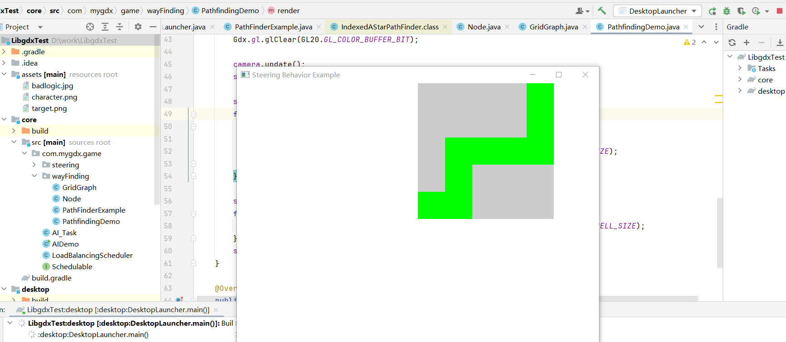
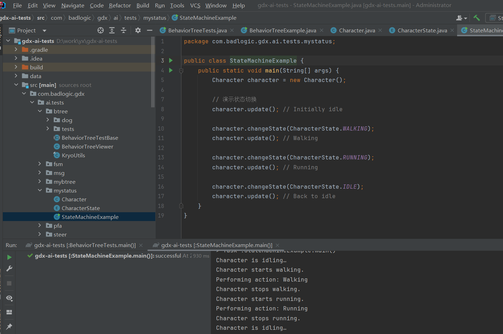
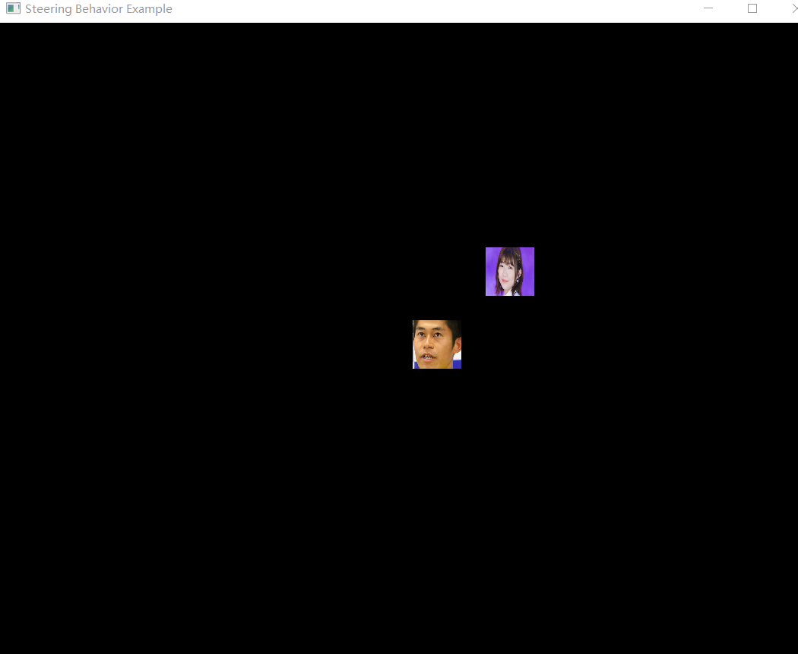
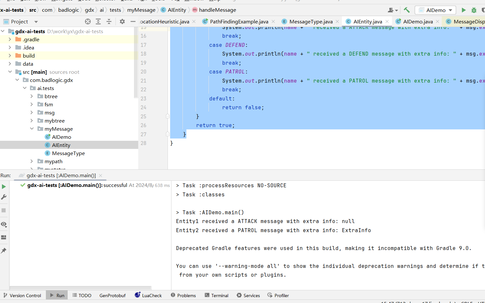
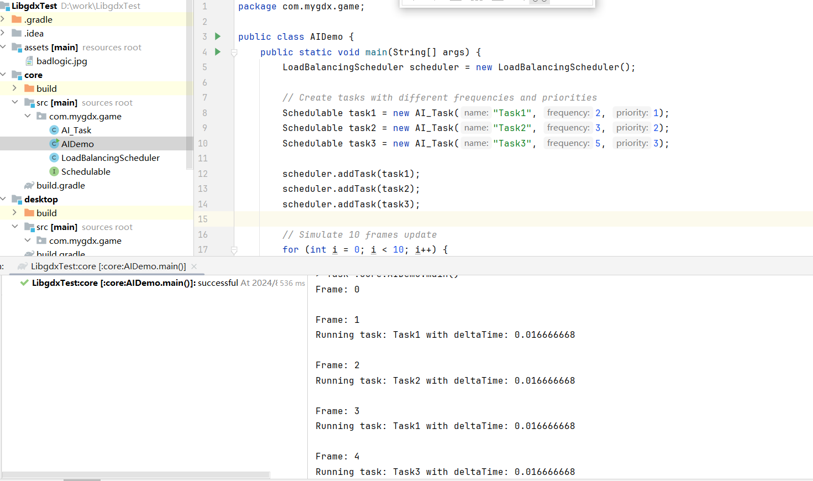

## 8.1 路径寻路（代码在mypath包下）

​        在使用 GDX-AI 进行路径寻路时，我们通常需要使用 Graph 接口和相关类，如 Node 和 Connection。下面是一个简单的示例，演示如何在 Java 中使用 GDX-AI 来实现路径寻路。

首先，确保你已在项目中添加了 GDX-AI 的依赖库。如果你使用的是 Gradle，你可以在 `build.gradle` 文件中添加以下依赖：

```
implementation ‘com.badlogicgames.gdx:gdx-ai:1.8.2’
```

示例 Java 代码

```java
import com.badlogic.gdx.ai.pfa.Connection;
import com.badlogic.gdx.ai.pfa.DefaultGraphPath;
import com.badlogic.gdx.ai.pfa.Graph;
import com.badlogic.gdx.ai.pfa.IndexedGraph;
import com.badlogic.gdx.ai.pfa.PathFinderRequest;
import com.badlogic.gdx.ai.pfa.PathSmoother;
import com.badlogic.gdx.ai.pfa.PathSmootherRequest;
import com.badlogic.gdx.ai.pfa.SmoothableGraphPath;
import com.badlogic.gdx.ai.pfa.SmoothableGraphPath.NodeWithPosition;
import com.badlogic.gdx.ai.pfa.Smoother;
import com.badlogic.gdx.ai.pfa.Heuristic;
import com.badlogic.gdx.ai.pfa.indexed.IndexedAStarPathFinder;
import com.badlogic.gdx.ai.pfa.indexed.IndexedGraph;
import com.badlogic.gdx.utils.Array;

class Node {
    int index;
    float x, y;

    public Node(int index, float x, float y) {
        this.index = index;
        this.x = x;
        this.y = y;
    }
}

class MapGraph implements IndexedGraph<Node> {
    Array<Node> nodes = new Array<>();
    Array<Connection<Node>> connections = new Array<>();

    @Override
    public int getIndex(Node node) {
        return node.index;
    }

    @Override
    public int getNodeCount() {
        return nodes.size;
    }

    @Override
    public Array<Connection<Node>> getConnections(Node fromNode) {
        return connections; // Simplified for example purposes
    }
}

class LocationHeuristic implements Heuristic<Node> {
    @Override
    public float estimate(Node node, Node endNode) {
        return Math.abs(node.x - endNode.x) + Math.abs(node.y - endNode.y);
    }
}

public class PathFindingExample {
    public static void main(String[] args) {
        MapGraph graph = new MapGraph();
        Node startNode = new Node(0, 0, 0);
        Node goalNode = new Node(1, 10, 10);

        graph.nodes.add(startNode);
        graph.nodes.add(goalNode);

        Connection<Node> connection = new Connection<>() {
            @Override
            public float getCost() {
                return 1; // Same cost for simplicity
            }

            @Override
            public Node getFromNode() {
                return startNode;
            }

            @Override
            public Node getToNode() {
                return goalNode;
            }
        };

        graph.connections.add(connection);

        IndexedAStarPathFinder<Node> pathFinder = new IndexedAStarPathFinder<>(graph);
        DefaultGraphPath<Node> path = new DefaultGraphPath<>();
        pathFinder.searchNodePath(startNode, goalNode, new LocationHeuristic(), path);

        for (Node node : path) {
            System.out.println("Node: " + node.index);
        }
    }
}
```

说明

**Node 类**: 表示图中的节点，并包括索引和位置。

**MapGraph 类**: 实现了 `IndexedGraph` 接口，负责管理节点和连接。

**LocationHeuristic 类**: 实现了 `Heuristic` 接口，用于估计从一个节点到另一个节点的距离。

**Main 函数**: 创建一个简单的图并在其中进行路径规划。

***我的理解***（项目LibgdxTest的wayFinding包下）：首先定义节点Node，其次画图GridGraph去实现IndexedGraph<Node>用于表示图（Graph）结构，它允许图算法（如 A* 搜索）在任意节点上进行操作。实现 `IndexedGraph` 的类需要提供图中节点的相关信息和连接关系，以便算法可以执行路径查找等操作，在然后定义一个类PathFinderExample，去实现路径查找功能，路径查找所需要的三个属性

```java
private GridGraph gridGraph;
private IndexedAStarPathFinder<Node> pathFinder;
private Heuristic<Node> heuristic;
```

第一个图，可以对任意一个节点进行操作的一个类，第二个A*Start路径查找的查找器，第三个启发式函数，如果是曼哈顿距离则是获得最小路径的一个因子

```java
public PathFinderExample(GridGraph gridGraph) {
    this.gridGraph = gridGraph;
    this.pathFinder = new IndexedAStarPathFinder<>(gridGraph);

    // 使用曼哈顿距离作为启发式函数，可以更换为其他合适的启发式算法
    this.heuristic = (node, endNode) -> Math.abs(node.x - endNode.x) + Math.abs(node.y - endNode.y);
}

public GraphPath<Node> findPath(Node startNode, Node endNode) {
    GraphPath<Node> path = new DefaultGraphPath<>();
    pathFinder.searchNodePath(startNode, endNode, heuristic, path);
    return path;
}
```

第一个赋值，第二个查询方法，直接调用DefaultGraphPath的searchNodePath方法即可

返回的path应该就是最佳路径的新图，之后，咱们就可以用个for循环去取出node节点即可

```java
for (Node node : path) {
    shapeRenderer.rect(node.x * CELL_SIZE, node.y * CELL_SIZE, CELL_SIZE, CELL_SIZE);
}
```

那个大家直接看第二个图就行了，第一个项目我觉得演示的不是很好

运行结果如下：


**我来解释一下， pathFinder.searchNodePath(startNode, goalNode, new LocationHeuristic(), path);就是startNode节点到goalNode节点经过的节点**

**我在项目中加了一个更复杂的代码，可以更加展示这种效果，另外LibgdxTest里面的wayFinding包里面的项目也更加显示的演示了这种A*寻路方式**

运行结果：



## 8.2 AI行为树（代码在mybtree包下）

准备工作

确保你已经将 gdx-ai 库添加到你的项目中。如果使用 Maven，可以在 `pom.xml` 中添加如下依赖：

```xml
 <dependency>
    <groupId>com.badlogicgames.gdx</groupId>
    <artifactId>gdx-ai</artifactId>
    <version>1.8.2</version>
</dependency>
```

示例代码

下面是完整的示例代码：

```java
import com.badlogic.gdx.ai.btree.BehaviorTree;
import com.badlogic.gdx.ai.btree.LeafTask;
import com.badlogic.gdx.ai.btree.Task;
import com.badlogic.gdx.ai.btree.branch.Sequence;
import com.badlogic.gdx.ai.btree.decorator.Repeat;
import com.badlogic.gdx.ai.btree.leaf.Success;
import com.badlogic.gdx.ai.utils.random.ConstantIntegerDistribution;

// 定义角色类
class Character {
    public void sayHello() {
        System.out.println(“Hello! I am a character in this game.”);
    }
}

// 自定义任务实现
class PrintHelloTask extends LeafTask<Character> {
    @Override
    public Status execute() {
        Character character = getObject();
        character.sayHello();
        return Status.SUCCEEDED;
    }

    @Override
    protected Task<Character> copyTo(Task<Character> task) {
        return task;
    }
}

// 主类
public class BehaviorTreeExample {
    public static void main(String[] args) {
        Character character = new Character();
        BehaviorTree<Character> behaviorTree = new BehaviorTree<>(createBehaviorTreeStructure(), character);

        for (int i = 0; i < 10; i++) {
            behaviorTree.step();
        }
    }

    private static Task<Character> createBehaviorTreeStructure() {
        Sequence<Character> rootSequence = new Sequence<>();
        // 使用 ConstantIntegerDistribution 来指定重复次数
        rootSequence.addChild(new Repeat<>(new ConstantIntegerDistribution(1), new PrintHelloTask()));
        rootSequence.addChild(new Success<Character>());
        return rootSequence;
    }
}
```

代码详解

1. 定义角色类

`Character` 类是我们模拟的游戏角色，拥有一个简单的方法 `sayHello`，用于输出打招呼信息。

```java
class Character {
    public void sayHello() {
        System.out.println(“Hello! I am a character in this game.”);
    }
}
```


2. 实现自定义任务

`PrintHelloTask` 是一个自定义的任务，继承自 `LeafTask<Character>`。它的主要逻辑是调用角色的 `sayHello` 方法。

```java
class PrintHelloTask extends LeafTask<Character> {
    @Override
    public Status execute() {
        Character character = getObject();
        character.sayHello();
        return Status.SUCCEEDED;
    }

    @Override
    protected Task<Character> copyTo(Task<Character> task) {
        return task;
    }
}
```


3. 主类与行为树创建

在 `BehaviorTreeExample` 中，我们创建了一个角色实例，以及一个行为树实例，随后运行一个简单的循环来执行行为树的逻辑。

```java
public class BehaviorTreeExample {
    public static void main(String[] args) {
        Character character = new Character();
        BehaviorTree<Character> behaviorTree = new BehaviorTree<>(createBehaviorTreeStructure(), character);

        for (int i = 0; i < 10; i++) {
            behaviorTree.step();
        }
    }

    private static Task<Character> createBehaviorTreeStructure() {
        Sequence<Character> rootSequence = new Sequence<>();
        // 使用 ConstantIntegerDistribution 来指定重复次数
        rootSequence.addChild(new Repeat<>(new ConstantIntegerDistribution(1), new PrintHelloTask()));
        rootSequence.addChild(new Success<Character>());
        return rootSequence;
    }
}
```


4. 行为树结构

在 `createBehaviorTreeStructure` 方法中，我们定义了行为树的结构。使用 `Sequence` 节点作为根节点，添加一个 `Repeat` 装饰器来控制 `PrintHelloTask` 的执行次数为 1 次。

```java
private static Task<Character> createBehaviorTreeStructure() {
    Sequence<Character> rootSequence = new Sequence<>();
    rootSequence.addChild(new Repeat<>(new ConstantIntegerDistribution(1), new PrintHelloTask()));
    rootSequence.addChild(new Success<Character>());
    return rootSequence;
}
```

运行结果：


## 8.3 状态机，完整代码（代码在mystatus包下）

LibGDX 的 gdx-ai 库支持有限状态机（Finite State Machine, FSM）来管理对象的状态转换，这在游戏开发中广泛用于管理角色行为状态。下面是一个简单的 Java 示例，展示如何使用 gdx-ai 实现状态机并进行演示。

准备工作

确保你已经将 gdx-ai 库添加到你的项目中。如果使用 Maven，可以在 `pom.xml` 中添加如下依赖：

```xml
<dependency>
    <groupId>com.badlogicgames.gdx</groupId>
    <artifactId>gdx-ai</artifactId>
    <version>1.8.2</version>
</dependency>
```

示例代码

以下是一个完整的实现状态机的 Java 示例代码：

```java
import com.badlogic.gdx.ai.fsm.State;
import com.badlogic.gdx.ai.fsm.StateMachine;
import com.badlogic.gdx.ai.fsm.DefaultStateMachine;
import com.badlogic.gdx.ai.msg.Telegram;

class Character {
    private StateMachine<Character, CharacterState> stateMachine;

    public Character() {
        stateMachine = new DefaultStateMachine<>(this, CharacterState.IDLE);
    }

    public void update() {
        stateMachine.update();
    }

    public void changeState(CharacterState newState) {
        stateMachine.changeState(newState);
    }

    public StateMachine<Character, CharacterState> getStateMachine() {
        return stateMachine;
    }

    public void performAction(String action) {
        System.out.println("Performing action: " + action);
    }
}

enum CharacterState implements State<Character> {
    IDLE {
        @Override
        public void update(Character character) {
            System.out.println(“Character is idling…”);
        }
    },
    WALKING {
        @Override
        public void enter(Character character) {
            System.out.println(“Character starts walking.”);
        }

        @Override
        public void update(Character character) {
            character.performAction(“Walking”);
        }

        @Override
        public void exit(Character character) {
            System.out.println(“Character stops walking.”);
        }
    },
    RUNNING {
        @Override
        public void enter(Character character) {
            System.out.println(“Character starts running.”);
        }

        @Override
        public void update(Character character) {
            character.performAction(“Running”);
        }

        @Override
        public void exit(Character character) {
            System.out.println(“Character stops running.”);
        }
    };

    @Override
    public void enter(Character entity) {
    }

    @Override
    public void update(Character entity) {
    }

    @Override
    public void exit(Character entity) {
    }

    @Override
    public boolean onMessage(Character entity, Telegram telegram) {
        return false;
    }
}

public class StateMachineExample {
    public static void main(String[] args) {
        Character character = new Character();

        // 演示状态切换
        character.update(); // Initially idle

        character.changeState(CharacterState.WALKING);
        character.update(); // Walking

        character.changeState(CharacterState.RUNNING);
        character.update(); // Running

        character.changeState(CharacterState.IDLE);
        character.update(); // Back to idle
    }
}
```

 代码解析

\- **Character 类**: 角色类主要管理状态机并调用其更新和状态切换方法。

\- **CharacterState 枚举**: 定义了角色的所有可能状态，包括 `IDLE`、`WALKING` 和 `RUNNING`，每个状态都实现了 `State` 接口，通过 `enter`、`update` 和 `exit` 方法来管理状态特定的行为和打印信息。

\- **StateMachineExample 类**: 主类演示状态机的使用，通过角色实例管理状态并触发变化。

 执行机制

1. **初始化状态**：在 `Character` 的构造函数中初始化状态机，初始状态为 `IDLE`。

2. **状态更新**：在 `update()` 方法中调用当前状态的 `update` 行为。

3. **状态切换**：通过 `changeState()` 方法切换角色的当前状态。

运行结果：




## 8.4 转向行为，完整代码（代码在LibgdxTest项目的core.game的steering包下的）

**完整代码：**

```java
package com.mygdx.game.steering;

import com.badlogic.gdx.ai.steer.Steerable;
import com.badlogic.gdx.ai.steer.SteeringBehavior;
import com.badlogic.gdx.ai.steer.SteeringAcceleration;
import com.badlogic.gdx.ai.utils.Location;
import com.badlogic.gdx.graphics.Texture;
import com.badlogic.gdx.graphics.g2d.Sprite;
import com.badlogic.gdx.math.MathUtils;
import com.badlogic.gdx.math.Vector2;

public class SteeringActor extends Sprite implements Steerable<Vector2> {
    private Vector2 position;
    private Vector2 linearVelocity;
    private float angularVelocity;
    private float boundingRadius;
    private boolean tagged;
    
    private float maxLinearSpeed;
    private float maxLinearAcceleration;
    private float maxAngularSpeed;
    private float maxAngularAcceleration;

    private boolean independentFacing;

    private SteeringBehavior<Vector2> steeringBehavior;
    private SteeringAcceleration<Vector2> steeringOutput;

    public SteeringActor(Texture texture) {
        super(texture);
        this.position = new Vector2(getX(), getY());
        this.linearVelocity = new Vector2();
        this.boundingRadius = Math.max(getWidth(), getHeight()) / 2;
        this.steeringOutput = new SteeringAcceleration<>(new Vector2());
    }

    public SteeringActor(Texture texture, Vector2 initialPosition) {
        this(texture);
        this.position.set(initialPosition);
        setPosition(initialPosition.x, initialPosition.y);
    }

    public void setSteeringBehavior(SteeringBehavior<Vector2> steeringBehavior) {
        this.steeringBehavior = steeringBehavior;
    }

    public void applySteering(float deltaTime) {
        if (steeringBehavior != null) {
            steeringBehavior.calculateSteering(steeringOutput);

            // Apply acceleration to velocity
            linearVelocity.mulAdd(steeringOutput.linear, deltaTime).limit(getMaxLinearSpeed());

            // Update position and angle
            position.mulAdd(linearVelocity, deltaTime);
            setPosition(position.x, position.y);

            if (independentFacing) {
                float newOrientation = vectorToAngle(linearVelocity);
                setOrientation(newOrientation);
                setRotation(newOrientation * MathUtils.radiansToDegrees);
            }
        }
    }

    @Override
    public Vector2 getPosition() {
        return position;
    }

    @Override
    public float getOrientation() {
        return (float) Math.toRadians(getRotation());
    }

    @Override
    public void setOrientation(float orientation) {
        setRotation((float) Math.toDegrees(orientation));
    }

    @Override
    public Vector2 getLinearVelocity() {
        return linearVelocity;
    }

    @Override
    public float getAngularVelocity() {
        return angularVelocity;
    }

    @Override
    public float getBoundingRadius() {
        return boundingRadius;
    }

    @Override
    public boolean isTagged() {
        return tagged;
    }

    @Override
    public void setTagged(boolean tagged) {
        this.tagged = tagged;
    }

    @Override
    public float getZeroLinearSpeedThreshold() {
        return 0.1f;
    }

    @Override
    public void setZeroLinearSpeedThreshold(float value) {
        // no-op
    }

    @Override
    public float getMaxLinearSpeed() {
        return maxLinearSpeed;
    }

    @Override
    public void setMaxLinearSpeed(float maxLinearSpeed) {
        this.maxLinearSpeed = maxLinearSpeed;
    }

    @Override
    public float getMaxLinearAcceleration() {
        return maxLinearAcceleration;
    }

    @Override
    public void setMaxLinearAcceleration(float maxLinearAcceleration) {
        this.maxLinearAcceleration = maxLinearAcceleration;
    }

    @Override
    public float getMaxAngularSpeed() {
        return maxAngularSpeed;
    }

    @Override
    public void setMaxAngularSpeed(float maxAngularSpeed) {
        this.maxAngularSpeed = maxAngularSpeed;
    }

    @Override
    public float getMaxAngularAcceleration() {
        return maxAngularAcceleration;
    }

    @Override
    public void setMaxAngularAcceleration(float maxAngularAcceleration) {
        this.maxAngularAcceleration = maxAngularAcceleration;
    }

    public Vector2 newVector() {
        return new Vector2();
    }

    @Override
    public float vectorToAngle(Vector2 vector) {
        return (float) Math.atan2(-vector.x, vector.y);
    }

    @Override
    public Vector2 angleToVector(Vector2 outVector, float angle) {
        outVector.x = -(float) Math.sin(angle);
        outVector.y = (float) Math.cos(angle);
        return outVector;
    }

    @Override
    public Location<Vector2> newLocation() {
        return null; // Implement if needed
    }
}
```

`SteeringActor` 类是一个实现了 `Steerable<Vector2>` 接口的角色类，能够应用 AI steering behaviors 来控制自身运动。下面是类中各个部分的详细解析：

类继承和接口实现

```
public class SteeringActor extends Sprite implements Steerable<Vector2>
```

\- **继承 `Sprite`**: `SteeringActor` 是一个能够在 2D 平面中渲染的图像实体。
\- **实现 `Steerable<Vector2>` 接口**: 表示该类支持方向操控和运动行为控制。

 成员变量

```java
private Vector2 position;
private Vector2 linearVelocity;
private float angularVelocity;
private float boundingRadius;
private boolean tagged;

private float maxLinearSpeed;
private float maxLinearAcceleration;
private float maxAngularSpeed;
private float maxAngularAcceleration;

private boolean independentFacing;

private SteeringBehavior<Vector2> steeringBehavior;
private SteeringAcceleration<Vector2> steeringOutput;
```


\- **位置和运动**：`position` 保存当前坐标，`linearVelocity` 和 `angularVelocity` 记录线性和角速度。
\- **边界半径**：用于碰撞检测的 `boundingRadius`。
\- **标记状态**：`tagged` 用于指示对象是否被标记，可用于群体行为。
\- **运动限制**：`maxLinearSpeed`、`maxLinearAcceleration`、`maxAngularSpeed` 和 `maxAngularAcceleration` 限制角色的速度和加速度。
\- **独立朝向**：`independentFacing` 确定是否独立于运动方向来设置朝向。
\- **AI 行为**：`steeringBehavior` 持有 AI steering 行为的实例，而 `steeringOutput` 是计算结果。

构造方法

```java
public SteeringActor(Texture texture)
public SteeringActor(Texture texture, Vector2 initialPosition)
```


\- **初始化**：构造方法初始化各种运动相关的变量，并设置纹理。第二个构造方法还允许直接定位初始位置。

 核心方法

`setSteeringBehavior`

```java
public void setSteeringBehavior(SteeringBehavior<Vector2> steeringBehavior)
```


\- **设置行为**：用于配置角色的AI steering行为。

`applySteering`

```java
public void applySteering(float deltaTime)
```


\- **应用运动学**：
\- 根据当前的 `steeringBehavior` 计算得到 `steeringOutput`。
\- 结合 `linearVelocity` 更新位置信息，通过 `deltaTime` 确保时间步长一致。
\- 当 `independentFacing` 为 `true` 时，根据线速度调整朝向。

Steerable 接口实现

位置信息

\- **`getPosition` / `getOrientation` / `setOrientation`**：处理实体的当前状态及其朝向。

 速度信息

\- **`getLinearVelocity` / `getAngularVelocity`**：获取当前速度信息。

 碰撞半径

\- **`getBoundingRadius`**：提供碰撞检测使用的对象半径。

 标记状态

\- **`isTagged` / `setTagged`**：用于获取和设置实体是否处于标记状态。

 速度限制

\- **`getMaxLinearSpeed` / `setMaxLinearSpeed`**：最大线速度。
\- **`getMaxLinearAcceleration` / `setMaxLinearAcceleration`**：最大线性加速度。
\- **`getMaxAngularSpeed` / `setMaxAngularSpeed`**：最大角速度。
\- **`getMaxAngularAcceleration` / `setMaxAngularAcceleration`**：最大角加速度。

映射转换

\- **`vectorToAngle` / `angleToVector`**：用于处理运动向量和方向角的转换。

其他方法

\- **`newVector`**: 返回新的 `Vector2` 实例，用于创建新的向量实例。
\- **`newLocation`**: 返回 null，需要时可以实现以支持具体位置的创建。

这一类主要处理角色的运动方向和速度，通过结合 libGDX 的 graphics 和 AI 库来进行角色状态的更新和显示。角色的行为通过 Steering 类实现的不同逻辑来定义，从而实现各种智能行为建模如寻路、避障、避开群体等。

**完整代码：**

```java
package com.mygdx.game.steering;

import com.badlogic.gdx.ApplicationAdapter;
import com.badlogic.gdx.Gdx;
import com.badlogic.gdx.ai.steer.behaviors.Arrive;
import com.badlogic.gdx.graphics.GL20;
import com.badlogic.gdx.graphics.OrthographicCamera;
import com.badlogic.gdx.graphics.g2d.Batch;
import com.badlogic.gdx.graphics.g2d.SpriteBatch;
import com.badlogic.gdx.math.Vector2;
import com.badlogic.gdx.utils.viewport.ExtendViewport;
import com.badlogic.gdx.utils.viewport.Viewport;
import com.badlogic.gdx.ai.steer.SteeringBehavior;
import com.badlogic.gdx.ai.steer.behaviors.Seek;
import com.badlogic.gdx.graphics.Texture;

public class SteeringBehaviorExample extends ApplicationAdapter {
    private static final float MAX_FORCE = 1f;
    private static final float MAX_VELOCITY = 100f;

    private Batch batch;
    private Texture characterTexture;
    private OrthographicCamera camera;
    private Viewport viewport;

    private SteeringActor character;
    private SteeringActor target;

    @Override
    public void create() {
        batch = new SpriteBatch();
        characterTexture = new Texture("character.png");

        camera = new OrthographicCamera();
        viewport = new ExtendViewport(1080, 920, camera);

        character = new SteeringActor(characterTexture);
        character.setMaxLinearSpeed(MAX_VELOCITY);
        character.setMaxLinearAcceleration(MAX_FORCE);

        Vector2 targetPosition = new Vector2(100, 100);
        target = new SteeringActor(new Texture("target.png"), targetPosition);
        character.setSize(64, 64);
        target.setSize(64, 64);
        // 使用 Arrive 行为替代 Seek 行为
        SteeringBehavior<Vector2> arriveBehavior = new Arrive<>(character, target)
                .setArrivalTolerance(0.001f)  // 设置到达目标的容忍距离
                .setDecelerationRadius(20)   // 在此半径内开始减速
                .setTimeToTarget(0.1f);       // 控制减速响应速度
        character.setSteeringBehavior(arriveBehavior);
    }

    @Override
    public void render() {
        Gdx.gl.glClear(GL20.GL_COLOR_BUFFER_BIT);

        character.applySteering(Gdx.graphics.getDeltaTime());

        batch.setProjectionMatrix(camera.combined);
        batch.begin();
        character.draw(batch);
        target.draw(batch);
        batch.end();
    }

    @Override
    public void resize(int width, int height) {
        viewport.update(width, height);
    }

    @Override
    public void dispose() {
        batch.dispose();
        characterTexture.dispose();
    }
}
```

`SteeringBehaviorExample` 类是一个使用 libGDX 框架构建的示例应用程序，演示了经典的 AI Steering 行为，在这里实现了一个角色到达目标点的行为。以下是这个类的完整解析：

类定义和成员变量

```java
public class SteeringBehaviorExample extends ApplicationAdapter {
    private static final float MAX_FORCE = 1f;
    private static final float MAX_VELOCITY = 100f;

    private Batch batch;
    private Texture characterTexture;
    private OrthographicCamera camera;
    private Viewport viewport;

    private SteeringActor character;
    private SteeringActor target;
```


\- **`ApplicationAdapter`**: 继承自 `ApplicationAdapter`，这是 libGDX 提供的一个实现 `ApplicationListener` 接口的简易基类。
\- **常量**: `MAX_FORCE` 和 `MAX_VELOCITY` 分别代表角色的最大加速度和最大速度。
\- **`Batch`**: 用于批量渲染 2D 图形的工具。
\- **`Texture`**: 角色的纹理。
\- **`OrthographicCamera`**: 传统的正交摄像机，用于2D渲染。
\- **`Viewport`**: 负责控制显示区域和坐标变换。
\- **`SteeringActor`**: 自定义的可动角色，包含角色和目标。

 create() 方法

```java
@Override
public void create() {
    batch = new SpriteBatch();
    characterTexture = new Texture(“character.png”);

    camera = new OrthographicCamera();
    viewport = new ExtendViewport(1080, 920, camera);

    character = new SteeringActor(characterTexture);
    character.setMaxLinearSpeed(MAX_VELOCITY);
    character.setMaxLinearAcceleration(MAX_FORCE);

    Vector2 targetPosition = new Vector2(100, 100);
    target = new SteeringActor(new Texture(“target.png”), targetPosition);
    character.setSize(64, 64);
    target.setSize(64, 64);

    SteeringBehavior<Vector2> arriveBehavior = new Arrive<>(character, target)
            .setArrivalTolerance(0.001f)
            .setDecelerationRadius(20)
            .setTimeToTarget(0.1f);
    character.setSteeringBehavior(arriveBehavior);
}
```


\- **初始化资源**: `SpriteBatch` 和 `Texture` 是渲染基础元素。
\- **摄像机和视口**: 设置了一个正交摄像机和伸缩视口以适应不同屏幕尺寸。
\- **角色配置**: 创建 `SteeringActor` 角色并设置其最大速度和加速度。
\- **目标配置**: 创建目标角色并设定初始位置。
\- **Arrive 行为**: 配置 `Arrive` 行为用于角色，替代了传统的 `Seek` 行为。
\- `setArrivalTolerance`: 设置停止的容忍阈值。
\- `setDecelerationRadius`: 开始减速的距离。
\- `setTimeToTarget`: 调节减速的响应时间。

 render() 方法

```java
@Override
public void render() {
    Gdx.gl.glClear(GL20.GL_COLOR_BUFFER_BIT);

    character.applySteering(Gdx.graphics.getDeltaTime());

    batch.setProjectionMatrix(camera.combined);
    batch.begin();
    character.draw(batch);
    target.draw(batch);
    batch.end();
}
```


\- **清屏**: 使用 `glClear` 清除屏幕，使渲染帧干净。
\- **应用行为**: 调用 `applySteering` 来更新角色状态。
\- **渲染**: 批量绘制角色和目标。

resize() 方法

```java
@Override
public void resize(int width, int height) {
    viewport.update(width, height);
}
```


\- **视口调整**: 调用 `viewport.update` 以适应窗口大小变化，确保图形正确缩放。

dispose() 方法

```java
@Override
public void dispose() {
    batch.dispose();
    characterTexture.dispose();
}
```


\- **资源清理**: 释放批处理和纹理资源以防止内存泄漏。

总结

`SteeringBehaviorExample` 类通过创建并配置 `SteeringActor` 对象以及其 `Arrive` 行为，实现简单的角色运动逻辑。该类展现了libGDX结合gdx-ai库的基本用法，是一个良好的入门示例，可帮助开发者理解如何在2D游戏场景中实现 AI 操控的运动行为什么。

运行结果：




## 8.6 消息处理（代码在myMessage包下）

消息处理在游戏中是非常重要的，比如说一个玩家攻击npc，这个时候就要传送一个attack的信息从玩家给到npc，同时npc拿到这个信息会进行逃跑或者反击处理，消息传递的过程中可以给其附加消息，就比如说当玩家带枪去攻击npc的时候，npc就只能逃跑

1. 消息定义

首先，你需要定义消息的类型。在游戏中，消息通常用枚举类型来表示。

```java
public enum MessageType {
    ATTACK,
    DEFEND,
    PATROL
}
```

2. 消息监听器和派发器

接下来，设置消息监听器（一个可以接收消息的组件）和消息派发器（负责发送消息的对象）。

```java
import com.badlogic.gdx.ai.msg.*;

public class AIEntity implements Telegraph {
    private String name;

    public AIEntity(String name) {
        this.name = name;
    }

    @Override
    public boolean handleMessage(Telegram msg) {
        MessageType messageType = MessageType.values()[msg.message];
        switch (messageType) {
            case ATTACK:
                System.out.println(name + " received a ATTACK message with extra info: " + msg.extraInfo);
                break;
            case DEFEND:
                System.out.println(name + " received a DEFEND message with extra info: " + msg.extraInfo);
                break;
            case PATROL:
                System.out.println(name + " received a PATROL message with extra info: " + msg.extraInfo);
                break;
            default:
                return false;
        }
        return true;
    }
}

public class AIDemo {
    public static void main(String[] args) {
        // 创建实体和消息派发器
        AIEntity entity1 = new AIEntity(“Entity1”);
        AIEntity entity2 = new AIEntity(“Entity2”);

        MessageDispatcher dispatcher = new MessageDispatcher();

        // 注册实体到消息派发器
        dispatcher.addListener(entity1, MessageType.ATTACK.ordinal());
        dispatcher.addListener(entity2, MessageType.DEFEND.ordinal());
        dispatcher.addListener(entity2, MessageType.PATROL.ordinal());

        // 发送消息
        dispatcher.dispatchMessage(MessageType.ATTACK.ordinal());
        dispatcher.dispatchMessage(entity1, entity2, MessageType.PATROL.ordinal(), "ExtraInfo", false);
    }
}
```


 代码说明

1. **Telegraph 接口**: `AIEntity` 实现了 `Telegraph` 接口，使其能够接收消息。`handleMessage` 方法是处理收到消息的地方。

2. **MessageDispatcher**: `MessageDispatcher` 是负责消息发送的组件。它可以直接发送消息给指定的接收者，或广播消息给所有注册了监听器的实体。

3. **消息发送和接收**:
   \- 注册监听器：使用 `addListener` 方法来规定哪些实体对哪些消息感兴趣，此处通过 `MessageType` 的枚举索引来注册监听器。
   \- 发送消息：通过 `dispatchMessage` 方法发送消息。消息可以包括一个额外的信息体（如 `"ExtraInfo"`），以便接收者利用。

4. **handleMessage**: 接收到消息后，根据消息类型进行相应的操作。此处通过日志输出来模拟游戏中不同的响应行为。

 参数解析

 dispatcher.dispatchMessage(entity1, entity2, MessageType.PATROL.ordinal(), "ExtraInfo", false);

1. **`entity1`** (`Telegraph sender`):
   \- 这是消息的发送者。它是一个实现了 `Telegraph` 接口的对象。在游戏中，这通常是某个意识到需要触发事件或进行通信的角色或系统。

2. **`entity2`** (`Telegraph receiver`):
   \- 这是消息的接收者。它也是一个实现了 `Telegraph` 接口的对象。这个对象会被通知有消息到达并负责处理这个消息。如果接收者为 `null`，则消息会被广播给所有注册了该消息类型的监听器。

3. **`MessageType.PATROL.ordinal()`** (`int msg`):
   \- 这是消息的类型。`MessageType` 是一个枚举，`PATROL` 是其中的一个枚举常量。使用 `ordinal()` 方法将枚举常量转化为其枚举定义中的整数顺序（通常从 0 开始）。

4. **`"ExtraInfo"`** (`Object extraInfo`):
   \- 这是附加信息，随同消息一起发出。可以是任何对象，用于传递额外的数据或上下文，以便接收者理解消息的意图或具体内容。

5. **`false`** (`boolean needsReturnReceipt`):
   \- 这个参数表示是否需要消息回执（return receipt）。`false` 意味着不要求发送消息的确认回执，大多数情况下用于简单的单向通知。

运行结果如下：




## 8.7 调度（代码在LibgdxTest项目的core的game包下的）

下面是一个示例代码，演示了如何使用简单的任务调度系统来进行 AI 任务的分配和调度。此例子中，我们创建了一个基于频率的任务调度器，并为多个任务设置频率和优先级。当调度器在每帧更新时，它将根据这些参数来选择和运行任务。

示例代码

```java
import java.util.ArrayList;
import java.util.List;
import java.util.PriorityQueue;
import java.util.Queue;

interface Schedulable {
    void runTask(float deltaTime);
    int getFrequency();
    int getPriority();
}

class AI_Task implements Schedulable {
    private String name;
    private int frequency;
    private int priority;

    public AI_Task(String name, int frequency, int priority) {
        this.name = name;
        this.frequency = frequency;
        this.priority = priority;
    }

    @Override
    public void runTask(float deltaTime) {
        System.out.println("Running task: " + name + " with deltaTime: " + deltaTime);
    }

    @Override
    public int getFrequency() {
        return frequency;
    }

    @Override
    public int getPriority() {
        return priority;
    }
}

class LoadBalancingScheduler {
    private List<Schedulable> tasks = new ArrayList<>();
    private Queue<SchedulerTask> taskQueue = new PriorityQueue<>();
    private int frameCounter = 0;

    public void addTask(Schedulable task) {
        tasks.add(task);
    }

    public void update(float deltaTime) {
        frameCounter++;
        taskQueue.clear();
        for (Schedulable task : tasks) {
            if (frameCounter % task.getFrequency() == 0) {
                taskQueue.add(new SchedulerTask(task, deltaTime));
            }
        }

        while (!taskQueue.isEmpty()) {
            SchedulerTask schedulerTask = taskQueue.poll();
            schedulerTask.run();
        }
    }

    private static class SchedulerTask implements Comparable<SchedulerTask> {
        private Schedulable task;
        private float deltaTime;

        public SchedulerTask(Schedulable task, float deltaTime) {
            this.task = task;
            this.deltaTime = deltaTime;
        }

        @Override
        public int compareTo(SchedulerTask o) {
            return Integer.compare(o.task.getPriority(), this.task.getPriority());
        }

        public void run() {
            task.runTask(deltaTime);
        }
    }
}

public class AIDemo {
    public static void main(String[] args) {
        LoadBalancingScheduler scheduler = new LoadBalancingScheduler();

        // Create tasks with different frequencies and priorities
        Schedulable task1 = new AI_Task(“Task1”, 2, 1);
        Schedulable task2 = new AI_Task(“Task2”, 3, 2);
        Schedulable task3 = new AI_Task(“Task3”, 5, 3);

        scheduler.addTask(task1);
        scheduler.addTask(task2);
        scheduler.addTask(task3);

        // Simulate 10 frames update
        for (int i = 0; i < 10; i++) {
            System.out.println("Frame: " + i);
            scheduler.update(1.0f / 60.0f);  // Assuming 60 FPS
            System.out.println();
            try {
                Thread.sleep(1000 / 60); // Simulate frame duration
            } catch (InterruptedException e) {
                e.printStackTrace();
            }
        }
    }
}
```

代码说明

1. **Schedulable Interface**: 定义了一些必须实现的方法，以便任务可以被调度。每个任务都有频率和优先级。

2. **AI_Task Class**: 实现 `Schedulable` 接口，为任务提供了名称、频率和优先级。这些任务可以被调度系统使用。

3. **LoadBalancingScheduler Class**: 管理 `Schedulable` 任务，并根据“频率”和“优先级”决定哪些任务将在当前帧上运行。

4. **SchedulerTask**: 内部类，用于包装任务，并根据其优先级进行排序。

5. **AIDemo Class**: 包含主方法，演示了如何创建任务，并将它们添加到调度系统中。程序模拟了 10 帧的游戏循环。

解释：

 代码结构

1. **接口 `Schedulable`:**
   \- 这是一个接口，定义了需要实现的方法。
   \- **`runTask(float deltaTime)`:** 这个方法需要执行任务的逻辑。
   \- **`getFrequency()`:** 获取任务执行的频率。
   \- **`getPriority()`:** 获取任务的优先级。

2. **类 `AI_Task`:**
   \- 实现了 `Schedulable` 接口。
   \- **字段 `name`, `frequency`, `priority`:** 分别表示任务的名称、执行频率和优先级。
   \- **构造函数 `AI_Task(String name, int frequency, int priority)`:** 初始化任务的名称、频率和优先级。
   \- **方法 `runTask(float deltaTime)`:** 打印任务执行的日志。
   \- **方法 `getFrequency()` 和 `getPriority()`:** 返回任务的频率和优先级。

3. **类 `LoadBalancingScheduler`:**
   \- 管理和调度一组 `Schedulable` 任务。
   \- **`tasks`:** 存储所有添加的任务。
   \- **`taskQueue`:** 基于优先级的任务队列。
   \- **`frameCounter`:** 记录当前帧计数，用于决定哪些任务需要在当前帧中执行。
   \- **方法 `addTask(Schedulable task)`:** 向调度器添加一个任务。
   \- **方法 `update(float deltaTime)`:** 每帧调用一次，用于调度和处理任务。
   \- 清空 `taskQueue`。
   \- 遍历所有任务，检查是否需要在当前帧执行（`frameCounter % frequency == 0`）。
   \- 按优先级将需要运行的任务添加到 `taskQueue`。
   \- 执行所有在队列中的任务。

\- **内部类 `SchedulerTask`:**
\- 包装 `Schedulable` 对象，附带 `deltaTime` 信息。
\- 实现 `Comparable<SchedulerTask>` 接口，用于在队列中按优先级排序。
\- **`compareTo(SchedulerTask o)`:** 将任务按优先级倒序（优先级值高的任务优先执行）。
\- **方法 `run()`:** 执行封装的任务。

4. **类 `AIDemo`:**
   \- 包含主方法 `main(String[] args)`。
   \- **创建和配置任务:**
   \- 实例化三个不同频率和优先级的任务 `task1`, `task2`, `task3`。
   \- 将任务添加到 `LoadBalancingScheduler` 中。
   \- **模拟帧更新:**
   \- 运行一个循环，模拟 10 帧。
   \- 每一帧调用 `scheduler.update(1.0f / 60.0f)` 执行任务，假设每秒 60 帧。
   \- 使用 `Thread.sleep(1000 / 60)` 模拟帧的持续时间。

 代码中的注意事项
\- 使用优先级队列（`PriorityQueue`）自动管理任务的执行顺序。
\- 每个任务根据其频率控制是否在当前帧执行。
\- 如果任务的频率因数较大，则任务执行频率更低。
\- 使用优先级实现任务的时间分配策略，高优先级任务获得更多处理机会。
\- `LoadBalancingScheduler` 可以在游戏复杂时方便地管理多个任务，保持帧率稳定。

运行结果为：


