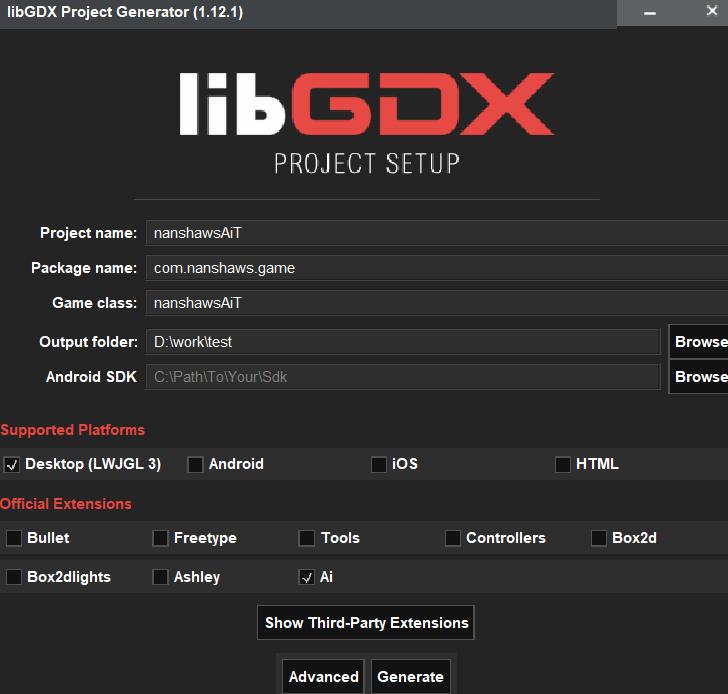
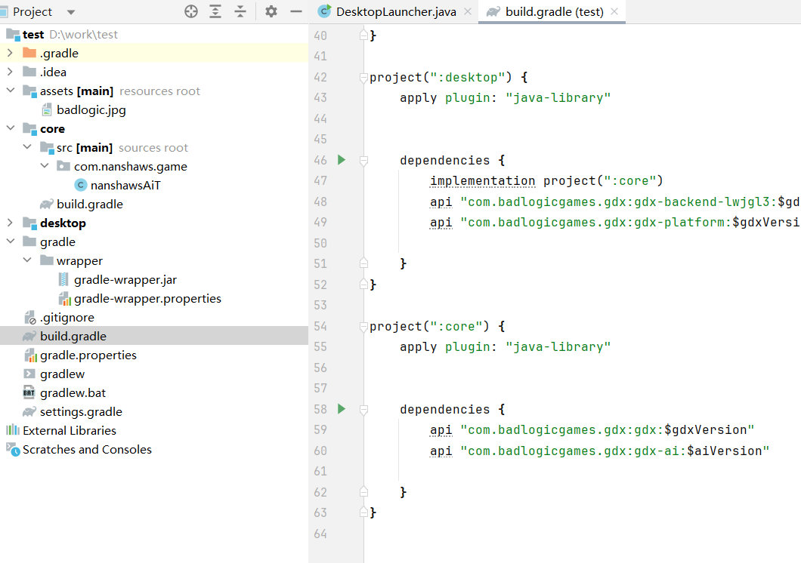

本章将讲解gdx-ai

# 第一步：引入依赖

## Maven 和 Gradle

gdxAI 框架在 Maven 中可用。最简单的方法是将框架添加为现有 [Maven](http://maven.apache.org/) 或 [Gradle](http://www.gradle.org/) 项目的依赖项。有两种类型的 gdxAI 版本。

- **官方**：经过良好测试的稳定软件包，定期发布。它的URL是：https://oss.sonatype.org/content/repositories/releases
- **快照**：作为夜间构建的结果，它们更有可能以意想不到的方式中断。它的URL是：https://oss.sonatype.org/content/repositories/snapshots

### Maven

首先，您需要将所需的存储库添加到您的文件中。根据是要发布还是快照来更改 URL。`pom.xml`

```
	<repositories>
		<repository>
			<id>sonatype</id>
			<name>Sonatype</name>
			<url>https://oss.sonatype.org/content/repositories/releases</url>
		</repository>
	</repositories>
```

然后你需要添加 gdxAI 依赖项。

```
	<dependency>
		<groupId>com.badlogicgames.gdx</groupId>
		<artifactId>gdx-ai</artifactId>
		<version>1.8.1</version>
	</dependency>
```

### Gradle

将 Maven 存储库添加到您的文件中。`build.gradle`

```
    repositories {
        maven { url "https://oss.sonatype.org/content/repositories/snapshots/" }
        maven { url "https://oss.sonatype.org/content/repositories/releases/" }
    }
```

将依赖项添加到元素。`dependencies`

```
    dependencies {
        classpath "com.badlogicgames.gdx:gdx-ai:1.8.1"
    }
```

### 构造器直接生成





# 第二步：使用gdx-ai

