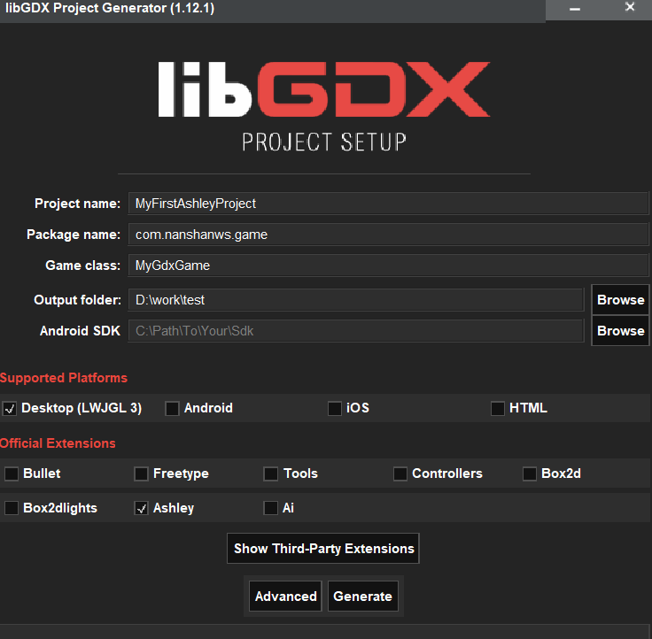
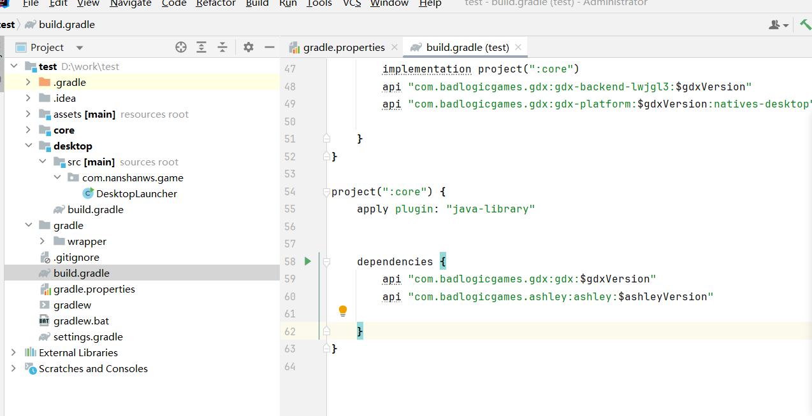

这个教程，咱们学习如何使用ashley这个框架

我的博客：

[libgdx ashley框架的讲解-CSDN博客](https://blog.csdn.net/m0_63251896/article/details/139538117?ops_request_misc=&request_id=&biz_id=102&utm_term=gdx-ashley&utm_medium=distribute.pc_search_result.none-task-blog-2~all~sobaiduweb~default-0-139538117.nonecase&spm=1018.2226.3001.4187)

**要注意：ashley框架是完全不依赖于libgdx的，抛开libgdx，ashley可以单独执行完整**

# 第一步，下载依赖

### Maven

首先，您需要将所需的存储库添加到您的文件中。根据是要发布还是快照来更改 URL。`pom.xml`

```
	<repositories>
		<repository>
			<id>sonatype</id>
			<name>Sonatype</name>
			<url>https://oss.sonatype.org/content/repositories/releases</url>
		</repository>
	</repositories>
```

然后，您需要添加 Ashley 依赖项。

```
	<dependency>
		<groupId>com.badlogicgames.ashley</groupId>
		<artifactId>ashley</artifactId>
		<version>1.7.3</version>
	</dependency>
```

### Gradle

将 Maven 存储库添加到您的文件中。`build.gradle`

```
    repositories {
        maven { url "https://oss.sonatype.org/content/repositories/snapshots/" }
        maven { url "https://oss.sonatype.org/content/repositories/releases/" }
    }
```

将依赖项添加到元素。`dependencies`

```
    dependencies {
        implementation "com.badlogicgames.ashley:ashley:1.7.3"
    }
```

当然咱们使用的是libgdx的官方的构造器的话，可以直接勾选ashley





# 第二步，认识框架

Ashley 提供了一个非常简单易懂的 API。下面是一个 UML 类图，它将帮助您了解 Ashley 的体系结构。


- **[实体](http://javadoc.io/static/com.badlogicgames.ashley/ashley/1.7.4/com/badlogic/ashley/core/Entity.html)**：组件的简单容器。
- **[组件](https://javadoc.io/static/com.badlogicgames.ashley/ashley/1.7.4/com/badlogic/ashley/core/Component.html)**：游戏组件实现的接口，它们应该是没有任何逻辑的数据袋。
- **[ComponentMapper](https://javadoc.io/static/com.badlogicgames.ashley/ashley/1.7.4/com/badlogic/ashley/core/ComponentMapper.html)**：提供超快的实体组件检索。
- **[族](https://javadoc.io/static/com.badlogicgames.ashley/ashley/1.7.4/com/badlogic/ashley/core/Family.html)**：用于表示具有特定组件集合的一组实体。
- **[引擎](https://javadoc.io/static/com.badlogicgames.ashley/ashley/1.7.4/com/badlogic/ashley/core/Engine.html)**：框架的主类，管理所有实体、系统和侦听器。
- **[EntitySystem](https://javadoc.io/static/com.badlogicgames.ashley/ashley/1.7.4/com/badlogic/ashley/core/EntitySystem.html)**：允许您实现可以在给定族的实体上操作的游戏逻辑。
- **[EntityListener](https://javadoc.io/static/com.badlogicgames.ashley/ashley/1.7.4/com/badlogic/ashley/core/EntityListener.html)**：可用于通知实体相关事件。

每个人物或者标签都可以称之为实体，比如说一个马里奥游戏，马里奥、乌龟和金币都可以被视为实体。每个实体都可以拥有一组组件，这些组件定义了实体的数据和状态。例如，马里奥可能有位置组件（PositionComponent）、移动组件（MovementComponent）和图形组件（GraphicsComponent）等。

这里的实体就是Entity entity = engine.createEntity(); 实体添加组件就是entity.add(new PositionComponent(10, 0)); 而MovementSystem就是各个组件合在一起的逻辑原理

# 第三步，使用框架

### 第一步：创建组件

```java
package com.nanshanws.game.components;

import com.badlogic.ashley.core.Component;

public class PositionComponent implements Component {
	public float x = 0.0f;
	public float y = 0.0f;

	public PositionComponent(float x, float y) {
		this.x = x;
		this.y = y;
	}
}
```

```
package com.nanshanws.game.components;

import com.badlogic.ashley.core.Component;

public class VelocityComponent implements Component {
	public float x = 0.0f;
	public float y = 0.0f;

	public VelocityComponent(float x, float y) {
		this.x = x;
		this.y = y;
	}
}
```

### 第二步：创建系统

```
package com.nanshanws.game.systems;
import com.badlogic.ashley.core.*;
import com.badlogic.ashley.utils.ImmutableArray;
import com.nanshanws.game.components.PositionComponent;
import com.nanshanws.game.components.VelocityComponent;

public class MovementSystem extends EntitySystem {
	public ImmutableArray<Entity> entities;
	private ComponentMapper<PositionComponent> pm = ComponentMapper.getFor(PositionComponent.class);
	private ComponentMapper<VelocityComponent> vm = ComponentMapper.getFor(VelocityComponent.class);
	@Override
	public void addedToEngine (Engine engine) {
		entities = engine.getEntitiesFor(Family.all(PositionComponent.class, VelocityComponent.class).get());
		System.out.println("移动引擎添加成功");
	}

	@Override
	public void removedFromEngine (Engine engine) {
		System.out.println("移动引擎移除成功");
		entities = null;
	}

	@Override
	public void update (float deltaTime) {
         //开始更改你的位置

		for (int i = 0; i < entities.size(); ++i) {
			Entity e = entities.get(i);

			PositionComponent p = pm.get(e);
			VelocityComponent m = vm.get(e);

			p.x += m.x * deltaTime;
			p.y += m.y * deltaTime;
			System.out.println("x="+p.x+"....y="+p.y);
		}

		System.out.println(entities.size() + "个实体已被执行，其位置都发生了改变");
	}
}

```

### 第三步：编写主类

```
package com.nanshanws.game;

import com.badlogic.ashley.core.Engine;
import com.badlogic.ashley.core.Entity;
import com.badlogic.ashley.core.EntityListener;
import com.nanshanws.game.components.PositionComponent;
import com.nanshanws.game.components.VelocityComponent;
import com.nanshanws.game.systems.MovementSystem;

public class Main {
    public static void main(String[] args) {
        Engine engine = new Engine();

        Listener listener = new Listener();
        engine.addEntityListener(listener);

        MovementSystem movementSystem = new MovementSystem();
        engine.addSystem(movementSystem);

        /**
         * 批量添加实体
         */
        for (int i = 0; i < 10; i++) {
            Entity entity = engine.createEntity();
            entity.add(new PositionComponent(10, 0));
            entity.add(new VelocityComponent(10, 2));

            engine.addEntity(entity);
        }

        System.out.println("MovementSystem has: " + movementSystem.entities.size() + " entities.");

        for (int i = 0; i < 10; i++) {
            engine.update(0.25f);

        }

        /**
         * 一般基础从单独开始添加
         * 单独添加实体
         */
        System.out.println("单独添加实体");
        Entity entity = engine.createEntity();
        entity.add(new PositionComponent(10, 0));
        entity.add(new VelocityComponent(10, 2));
        engine.addEntity(entity);
        //单独给实体添加引擎
        MovementSystem movementSystem1 = new MovementSystem();
        engine.addSystem(movementSystem1);
        //单独改变启动引擎
        engine.update(3f);
        //单独实体销毁移动引擎
        System.out.println("单独实体销毁移动引擎");
        engine.removeSystem(movementSystem1);

        //销毁所有实体
        engine.removeAllEntities();

        engine.removeEntityListener(listener);


    }
    public static class Listener implements EntityListener {

        @Override
        public void entityAdded (Entity entity) {
            System.out.println("实体添加 " + entity);
        }

        @Override
        public void entityRemoved (Entity entity) {
            System.out.println("实体删除 " + entity);
        }
    }
}

```