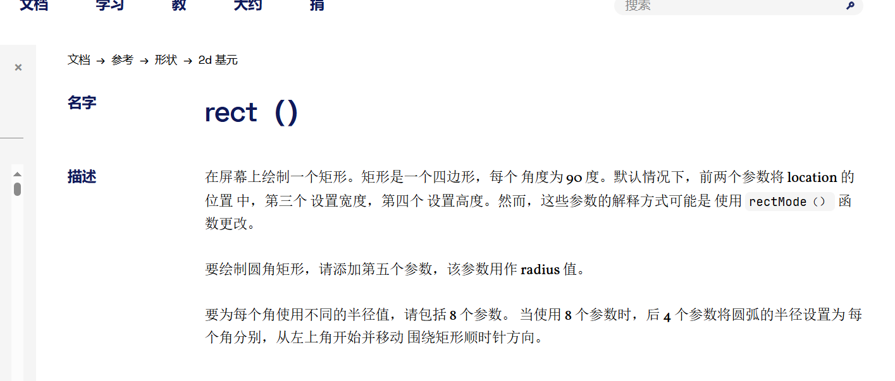
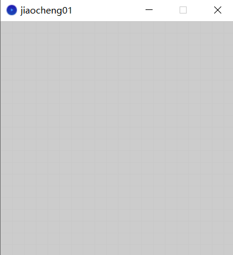
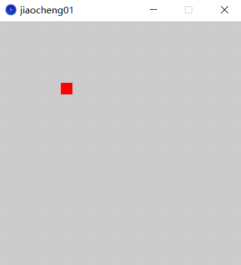
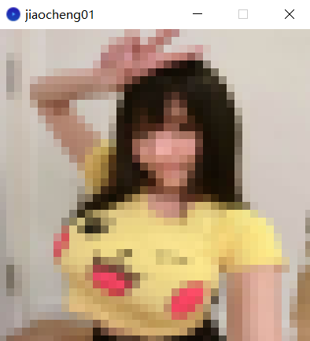
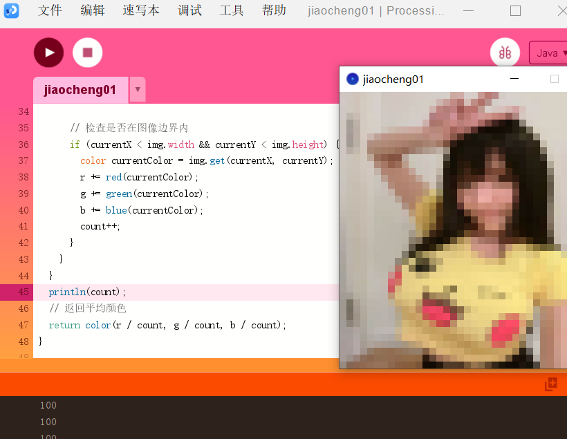
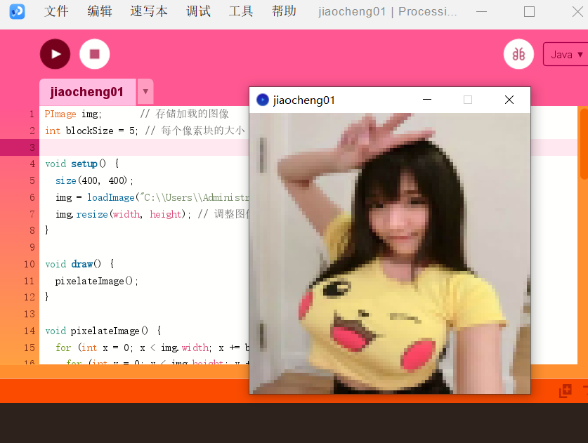
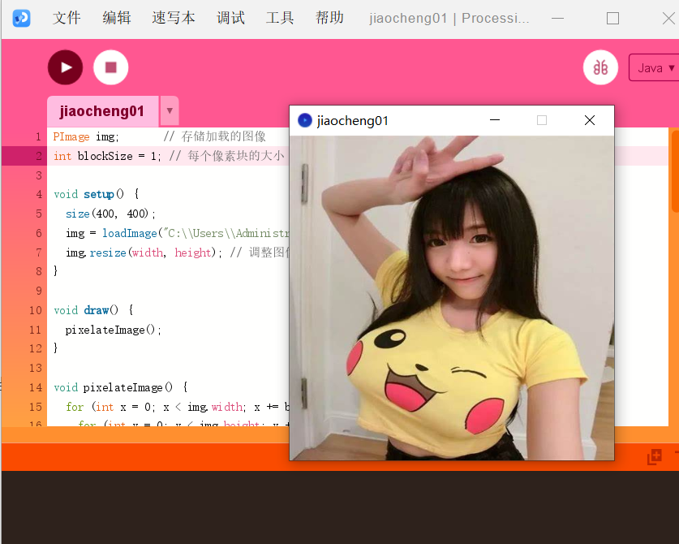

# processing像素画教程

前提：各位已经按照了processing

## 第一步：创建一个简单的网格

我们首先创建一个网格来定义我们作品的像素画布。网格将帮助您在适当的位置绘制每个像素。

```java
int gridSize = 20; // 每个像素的大小
int cols, rows;
void setup() {
  size(400, 400); // 设置画布大小
  cols = width / gridSize;
  rows = height / gridSize;
  noLoop(); // 不需要在draw中不断重复
}

void draw() {
  for (int i = 0; i < cols; i++) {
    for (int j = 0; j < rows; j++) {
      stroke(200); // 网格线颜色
      noFill();
      rect(i * gridSize, j * gridSize, gridSize, gridSize);
    }
  }
}
```

这个width是内置的变量，height也是内置变量，一般和你  size(400, 400);就是上面你设置的400，400

cols = width / gridSize;  代表的是多少列个方格，rows = height / gridSize; 代表的是多少行个方格

咱们使用  rect()函数，咱们可以查看官网，官网是这样介绍的：



就是绘制矩形而已

运行展示：




## 第二步：绘制像素

使用fill()和rect()来填充网格中的特定方块，这就是“绘制”一个像素。

```java
void draw() {
  for (int i = 0; i < cols; i++) {
    for (int j = 0; j < rows; j++) {
      stroke(200);
      noFill();
        
      rect(i * gridSize, j * gridSize, gridSize, gridSize);
      // 示例：绘制一个红色色块
      if (i == 5 && j == 5) {
        fill(255, 0, 0); // 红色
        rect(i * gridSize, j * gridSize, gridSize, gridSize);
      }
    }
  }
}
```


fill函数是填充颜色的意思，它在 rect（）函数的前面，就意味着填充这个单独的rect方块

运行展示：




完整代码：

```java
int gridSize = 20; // 每个像素的大小
int cols, rows;
void setup() {
  size(400, 400); // 设置画布大小
  cols = width / gridSize;
  rows = height / gridSize;
  noLoop(); // 不需要在draw中不断重复
}

void draw() {
  for (int i = 0; i < cols; i++) {
    for (int j = 0; j < rows; j++) {
      stroke(200);
      noFill();
        
      rect(i * gridSize, j * gridSize, gridSize, gridSize);
      // 示例：绘制一个红色色块
      if (i == 5 && j == 5) {
        fill(255, 0, 0); // 红色
        rect(i * gridSize, j * gridSize, gridSize, gridSize);
      }
    }
  }
}
```


## 第三步：将图片像素化

咱们了解以上基本内容之后，就可以实现将图片像素化的过程

完整演示代码如下：

```java
PImage img;       // 存储加载的图像
int blockSize = 10; // 每个像素块的大小

void setup() {
  size(400, 400);
  img = loadImage("C:\\Users\\Administrator\\Desktop\\t1.png"); // 替换为您图像的文件名
  img.resize(width, height); // 调整图像大小以适应窗口
}

void draw() {
  pixelateImage();
}

void pixelateImage() {
  for (int x = 0; x < img.width; x += blockSize) {
    for (int y = 0; y < img.height; y += blockSize) {
      color avgColor = averageColor(x, y);
      fill(avgColor);
      noStroke();
      rect(x, y, blockSize, blockSize);
    }
  }
}

// 计算给定块的平均颜色
color averageColor(int startX, int startY) {
  int r = 0, g = 0, b = 0;
  int count = 0;
  
  for (int dx = 0; dx < blockSize; dx++) {
    for (int dy = 0; dy < blockSize; dy++) {
      int currentX = startX + dx;
      int currentY = startY + dy;
      
      // 检查是否在图像边界内
      if (currentX < img.width && currentY < img.height) {
        color currentColor = img.get(currentX, currentY);
        r += red(currentColor);
        g += green(currentColor);
        b += blue(currentColor);
        count++;
      }
    }
  }
  
  // 返回平均颜色
  return color(r / count, g / count, b / count);
}
```

效果展示图：



首先，咱们需要一个存储加载的图像，就是上文的PImage img;  

第二，设置每个像素块的大小，int blockSize = 10;

第三， 给每个像素块上色，这里上色用的是 给定块的平均颜色  （这里说一下，noStroke();是不设置网格线颜色）

其算法我单独拿下来给各位讲解：

```java
// 计算给定块的平均颜色
color averageColor(int startX, int startY) {
  int r = 0, g = 0, b = 0;
  int count = 0;
  for (int dx = 0; dx < blockSize; dx++) {
    for (int dy = 0; dy < blockSize; dy++) {
      int currentX = startX + dx;
      int currentY = startY + dy;
      
      // 检查是否在图像边界内
      if (currentX < img.width && currentY < img.height) {
        color currentColor = img.get(currentX, currentY);
        r += red(currentColor);
        g += green(currentColor);
        b += blue(currentColor);
        count++;
      }
    }
  }
  
  // 返回平均颜色
  return color(r / count, g / count, b / count);
}
```

众所周知，颜色是由rgb决定的，这个算法很简单img.get是获取图片每一处的颜色的，r/count意味着这个像素块里面的红色除以这个像素块每个像素点，得到的就是像素的平均颜色，同理如下，count++是计算每个像素块的像素点的，按照我说的这个count应该为100.咱们可以测试一下：在返回平均颜色的上面加入打印count




咱们可以看到就是100，因为一个像素块长10像素点，宽10像素点，10*10可不就100.

## 第四步：修改图片像素化的模糊程度

咱们经过上面的学习，可以明白，如果想要图片像素更加清晰，那么咱们可以直接将像素块调小一点，这样计算平均值填充的颜色将会更加清晰。以下是将像素块调成5之后的效果



当然，咱们调成1，那就是原画了




